# 第一次实验报告

包括环境安装过程、建用户、建表、准备数据的详细过程（包含SQL命令及执行结果展示）。

## 1、（30分）安装Oracle数据库(19c 或 21c)、安装开发环境

由于安装时一直点的太快忘记截图，这里主要说一下我在安装时遇到的各种问题以及结果

首先在官网上下载了Oracle 21c的压缩包文件，下载完成后解压，双击setup.exe文件，但是没有反应

检查后发现包文件路径中含有中文字符，我想可能是这个问题

于是我将这整个包放在了我的目标安装路径下，路径不含中文和空格，双击setup.exe程序后进入安装界面，顺利安装

安装后创建并且实例化了一个数据库，设置了SID, 系统密码，全局密码等等。

SID（一般常设为XE, orcl, Orcale等等）阴差阳错设置成了localhost，和主机名相同，不过无妨，方便使用。


中间因为忘记密码想要重新安装Oracle，但是发现Oracle卸载相比MySQL而言过于复杂，遂放弃，选择重新实例化一个数据库，成功。

这里过程繁琐，忘记截图，以下是安装后的结果截图：


SQL plus中，利用系统管理员账户和密码成功连接Oracle数据库：

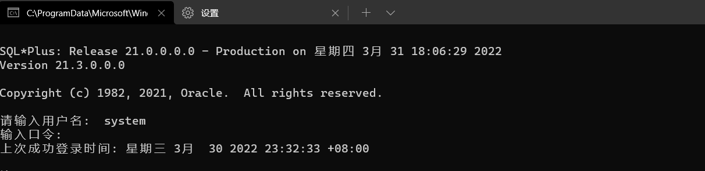

第一部分至此顺利完成


## 2、（10分）创建用于作业的数据库用户（之后的作业需要使用该用户模式完成）

创建vanxq账户，第一次失败，经过查询，全局用户需要在用户名前面加上c##，于是更改后成功


创建成功后无法登录和访问资源，于是再次进入数据库管理员账户进行授权。方便起见直接授予这个账户最高权限，也就是dba数据库管理员权限

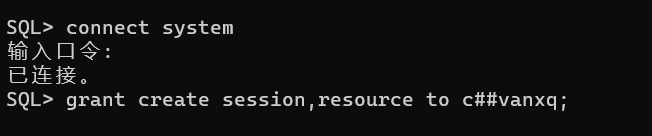

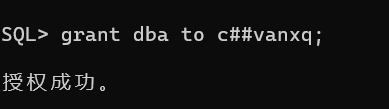

至此，用户模式设置完成。


## 3、（30分）利用SQL CREATE命令创建表

此部分 贴脚本代码和效果截图

利用CREATE命令创建6张表,根据外键依赖关系,颠倒了建表顺序.

(1) 班级信息表class，结构如下：

| 字段名            | 字段类型     | 约束条件     | 字段含义说明 |
| ----------------- | ------------ | ------------ | ------------ |
| classno           | Varchar2(6)  | Primary key  | 班级号       |
| classname         | Varchar(20)  | Not null     | 班级名称     |
| classmajor        | Varchar2(20) |              | 所属专业     |
| classdept         | Varchar2(20) |              | 所属系别     |
| **studentnumber** | **smallint** | **[20..40]** | **学生数**   |

SQL代码:

```sql
create table class
(
    classno       Varchar2(6)
            primary key,
    classname     Varchar(20) not null,
    classmajor    Varchar2(20),
    classdept     Varchar2(20),
    studentnumber smallint check ( studentnumber between 20 and 40)
);
```

效果图:

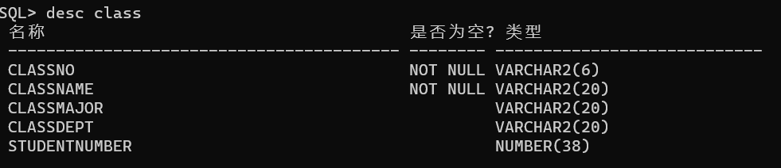

(2)课程信息表course，结构如下：

| 字段名  | 字段类型           | 约束条件    | 字段含义说明 |
| ------- | ------------------ | ----------- | ------------ |
| cno     | **Varchar2   (6)** | Primary key | 课程号       |
| cname   | Varchar(30)        | Not null    | 课程名称     |
| ccredit | smallint           | [1..4]      | 学分         |

SQL代码:

```sql
create table course
(
    cno     Varchar2(6)
            primary key,
    cname   Varchar(30) not null,
    ccredit smallint check ( ccredit between 1 and 4)
);
```

效果图:

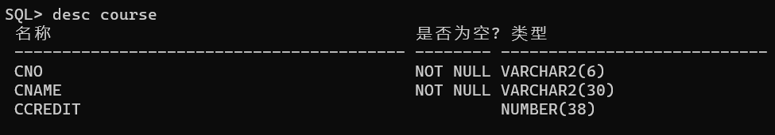

(3)  学生基本信息表student，结构如下：

| 字段名      | 字段类型              | 约束条件                  | 字段含义说明   |
| ----------- | --------------------- | ------------------------- | -------------- |
| sno         | **Varchar2****（8）** | Primary key               | 学号           |
| sname       | Varchar2(8)           | Not null                  | 姓名           |
| ssex        | Varchar2(2)           | ‘男’或’女’                | 性别           |
| sbirthday   | date                  |                           | 出生日期       |
| classno     | Varchar2(6)           | Foreign key               | 班级号         |
| Totalcredit | Smallint              | 初值为0                   | 已选修的总学分 |
| CreatedBy   | **Varchar2****（8）** | 默认值为：本人学号8位数字 | 创建者本人学号 |

SQL代码:

```sql
create table student
(
    sno           Varchar2(8)
        primary key ,
    sname         Varchar2(8) not null,
    ssex          Varchar2(3)  check(ssex in ('男' , '女')),
    sbirthday     date,
    classno       Varchar2(6),

    "Totalcredit" Smallint   default 0,
    "CreatedBy"   Varchar(8) default 20301174,
    foreign key (classno) references class(classno)
);
```

效果图:

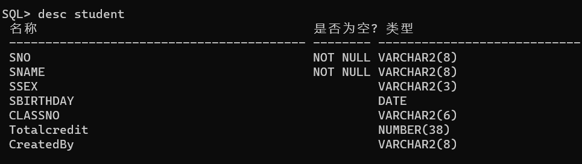

(4)教师信息表teacher，结构如下：

| 字段名    | 字段类型              | 约束条件                  | 字段含义说明   |
| --------- | --------------------- | ------------------------- | -------------- |
| tno       | Number(6)             | Primary key               | 教师号         |
| tname     | Varchar2(8)           | Not null                  | 教师姓名       |
| tsex      | Varchar2(2)           | ‘男’或’女’                | 性别           |
| tbirthday | date                  |                           | 出生日期       |
| ttitle    | Varchar2(20)          |                           | 职称           |
| CreatedBy | **Varchar2****（8）** | 默认值为：本人学号8位数字 | 创建者本人学号 |

SQL代码:

```sql
create table teacher
(
    tno         Number(6)
            primary key,
    tname       Varchar2(8) not null,
    tsex        Varchar2(2) check(tsex in ('男' , '女')),
    tbirthday   date,
    ttitle      Varchar2(20),
    "CreatedBy" Varchar2(8) default 20301174
);
```

效果图:

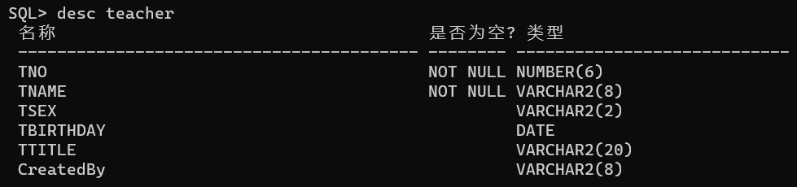

(5)选修课程信息表sc，结构如下：

| 字段名 | 字段类型    | 约束条件    | 字段含义说明 |
| ------ | ----------- | ----------- | ------------ |
| sno    | varchar (8) | Foreign key | 学号         |
| cno    | varchar (6) | Foreign key | 课程号       |
| grade  | integer     | [0..100]    | 成绩         |

SQL代码:

```sql
create table sc
(
    sno   varchar(8),
    foreign key (sno) references student(sno),
    cno   varchar(6),
    foreign key (cno) references course(cno),
    grade integer check ( grade between 0 and 100)
);
```

效果图:

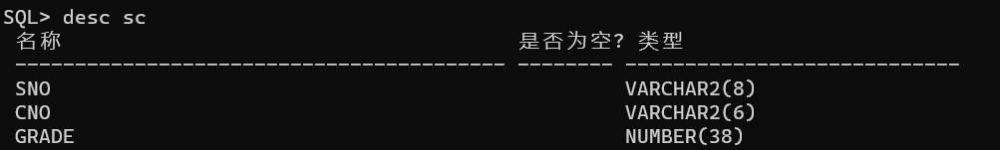

(6)教师任课情况表teaching，结构如下：

| 字段名   | 字段类型      | 约束条件                    | 字段含义说明 |
| -------- | ------------- | --------------------------- | ------------ |
| tno      | Number(6)     | Foreign key                 | 教师号       |
| cno      | Varchar (6)   | Foreign key                 | 课程号       |
| language | Varchar2 (10) | Chinese, Bilingual, English | 授课语言     |

SQL代码:

```sql
create table teaching
(
    tno      Number(6),
    foreign key (tno) references teacher(tno),
    cno      Varchar2(6),
    foreign key (cno) references course(cno),
    language Varchar2(10) check (language in ( 'Chinese' , 'Bilingual' , 'English') )
);
```

效果图:

SQL plus中：


DataGrip中表视图：

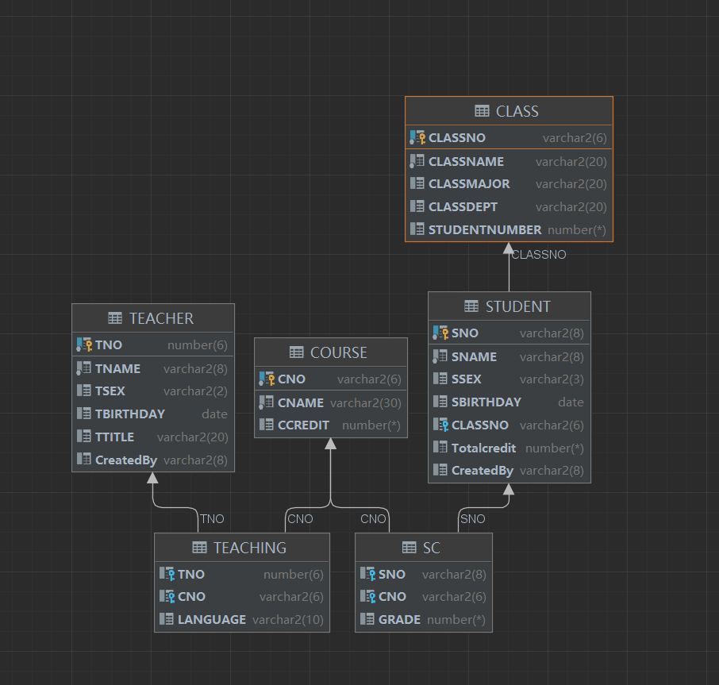

## 4、（30分）添加测试数据

（1） 利用INSERT命令，向以上建立的6张数据表中分别输入以下内容。

在datagrip中显示。

a) 学生基本信息表student表的内容如下（需要增加本人的相关信息）：

| sno      | sname  | ssex | sbirthday  | classno |
| -------- | ------ | ---- | ---------- | ------- |
| 20300010 | 李在   | 男   | 2001-10-1  | RJ2001  |
| 20300012 | 葛畅   | 男   | 2002-8-8   | RJ2001  |
| 20300015 | 刘晶   | 女   | 2003-5-22  | RJ2001  |
| 20300020 | 杨敏   | 女   | 2001-1-8   | RJ2001  |
| 20300030 | 胡贤斌 | 男   | 2002-10-8  | RJ2001  |
| 20300048 | 赵鸿泽 | 男   | 2003-6-6   | RJ2002  |
| 20300050 | 王威   | 男   | 2004-6-10  | RJ2002  |
| 20300067 | 赵玮   | 女   | 2002-8-21  | RJ2003  |
| 20300075 | 王娜娜 | 女   | 2003-9-23  | RJ2003  |
| 20300088 | 秦键   | 男   | 2004-3-1   | RJ2003  |
| 20300100 | 田邦仪 | 女   | 2003-2-26  | RJ2004  |
| 20300148 | 赵心砚 | 男   | 2002-4-25  | RJ2005  |
| 20300150 | 杨青   | 女   | 2004-11-15 | RJ2005  |
| 20300160 | 杨玲玲 | 女   | 2002-12-12 | RJ2006  |

SQL代码:

首先，sname中存在字符长度不够的情况，因此运行以下SQL命令更改

```sql
alter table STUDENT
    modify SNAME VARCHAR2(9);
```

随后执行insert命令:

```sql
insert into  STUDENT values ('20300010','李在','男',to_date('2001/10/1','yyyy/mm/dd'),'RJ2001',default,default);
insert into  STUDENT values ('20300012','葛畅','男',to_date('2002/8/8','yyyy/mm/dd'),'RJ2001',default,default);
insert into  STUDENT values ('20300015','刘晶','女',to_date('2003/5/22','yyyy/mm/dd'),'RJ2001',default,default);
insert into  STUDENT values ('20300020','杨敏','女',to_date('2001/1/8','yyyy/mm/dd'),'RJ2001',default,default);
insert into  STUDENT values ('20300030','胡贤斌','男',to_date('2002/10/8','yyyy/mm/dd'),'RJ2001',default,default);
insert into  STUDENT values ('20300048','赵鸿泽','男',to_date('2003/6/6','yyyy/mm/dd'),'RJ2002',default,default);
insert into  STUDENT values ('20300050','王威','男',to_date('2004/6/10','yyyy/mm/dd'),'RJ2002',default,default);
insert into  STUDENT values ('20300067','赵玮','女',to_date('2002/8/21','yyyy/mm/dd'),'RJ2003',default,default);
insert into  STUDENT values ('20300075','王娜娜','女',to_date('2003/9/23','yyyy/mm/dd'),'RJ2003',default,default);
insert into  STUDENT values ('20300088','秦键','男',to_date('2004/3/1','yyyy/mm/dd'),'RJ2003',default,default);
insert into  STUDENT values ('20300100','田邦仪','女',to_date('2003/2/26','yyyy/mm/dd'),'RJ2004',default,default);
insert into  STUDENT values ('20300148','赵心砚','男',to_date('2002/4/25','yyyy/mm/dd'),'RJ2005',default,default);
insert into  STUDENT values ('20300150','杨青','女',to_date('2004/11/15','yyyy/mm/dd'),'RJ2005',default,default);
insert into  STUDENT values ('20300160','杨玲玲','女',to_date('2002/12/12','yyyy/mm/dd'),'RJ2006',default,default);

```

效果图:

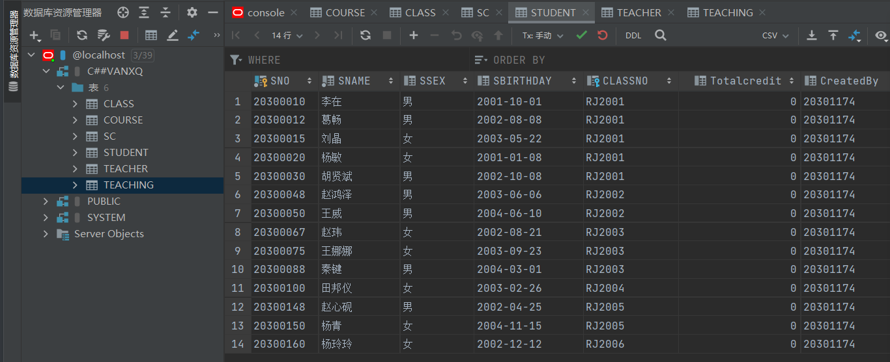

b) 班级信息表class的内容如下：

| classno | classname | Classs-major | classdept | studentnumber |
| ------- | --------- | ------------ | --------- | ------------- |
| RJ2001  | 软件2001  | 软件工程     | 软件开发  | 24            |
| RJ2002  | 软件2002  | 软件工程     | 软件开发  | 26            |
| RJ2003  | 软件2003  | 软件工程     | 数字媒体  | 25            |
| RJ2004  | 软件2004  | 软件工程     | 软件开发  | 25            |
| RJ2005  | 软件2005  | 软件工程     | 数字媒体  | 24            |
| RJ2006  | 软件2006  | 软件工程     | 软件开发  | 24            |

SQL代码:

```sql
insert into CLASS values ('RJ2001','软件2001','软件工程','软件开发',24);
insert into CLASS values ('RJ2002','软件2002','软件工程','软件开发',26);
insert into CLASS values ('RJ2003','软件2003','软件工程','数字媒体',25);
insert into CLASS values ('RJ2004','软件2004','软件工程','软件开发',25);
insert into CLASS values ('RJ2005','软件2005','软件工程','数字媒体',24);
insert into CLASS values ('RJ2006','软件2006','软件工程','软件开发',24);

```

效果图:

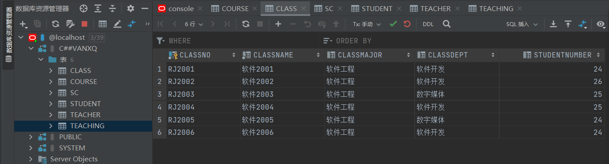

c) 课程信息表course的内容如下：

| Cno    | cname          | credit |
| ------ | -------------- | ------ |
| 800001 | 计算机基础     | 4      |
| 800002 | 程序设计语言   | 4      |
| 800003 | 数据结构       | 4      |
| 810011 | 数据库系统     | 4      |
| 810013 | 计算机网络     | 3      |
| 810015 | 微机原理与应用 | 4      |

SQL代码:

```sql
insert into COURSE values ('800001','计算机基础',4);
insert into COURSE values ('800002','程序设计语言',4);
insert into COURSE values ('800003','数据结构',4);
insert into COURSE values ('810011','数据库系统',4);
insert into COURSE values ('810013','计算机网络',3);
insert into COURSE values ('810015','微机原理与应用',4);
```

效果图:

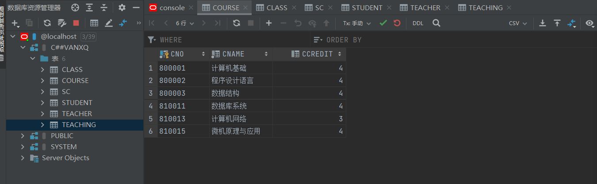

d) 选修课程情况表sc的内容如下（增加本人的相关信息）：

| Sno      | cno    | grade |
| -------- | ------ | ----- |
| 20300012 | 800003 | 88    |
| 20300015 | 800003 |       |
| 20300020 | 800003 | 91    |
| 20300030 | 800003 | 78    |
| 20300048 | 800003 | 97    |
| 20300100 | 810011 | 67    |
| 20300148 | 810011 | 58    |
| 20300150 | 810011 | 89    |
| 20300160 | 810011 | 71    |

SQL代码:

```sql
insert into SC values ('20300012','800003',88);
insert into SC values ('20300015','800003',null);
insert into SC values ('20300020','800003',91);
insert into SC values ('20300030','800003',78);
insert into SC values ('20300048','800003',97);
insert into SC values ('20300100','810011',67);
insert into SC values ('20300148','810011',58);
insert into SC values ('20300150','810011',89);
insert into SC values ('20300160','810011',71);
```

效果图:

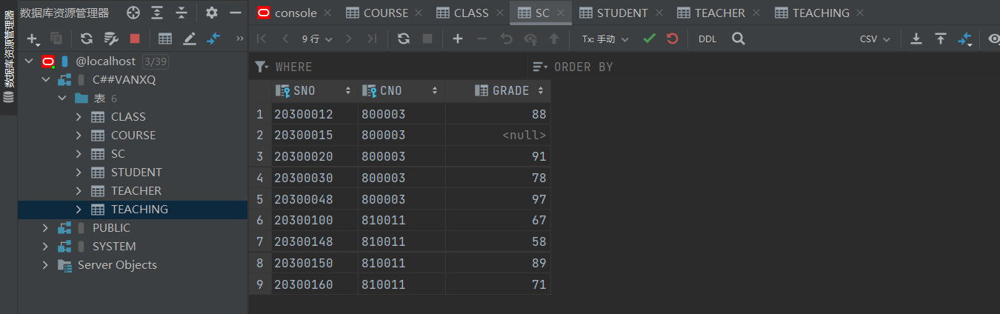

e) 教师信息表teacher的内容如下：

| Tno    | tname  | tsex | tbirthday  | ttitle |
| ------ | ------ | ---- | ---------- | ------ |
| 000001 | 李英   | 女   | 1975-11-3  | 讲师   |
| 000002 | 王大山 | 男   | 1969-3-2   | 副教授 |
| 000003 | 张朋   | 男   | 1970-2-13  | 讲师   |
| 000004 | 陈为军 | 男   | 1985-8-14  | 助教   |
| 000005 | 宋浩然 | 男   | 1976-4-23  | 讲师   |
| 000006 | 许红霞 | 女   | 1966-2-12  | 副教授 |
| 000007 | 徐永军 | 男   | 1962-1-24  | 教授   |
| 000008 | 李桂菁 | 女   | 1960-12-15 | 教授   |
| 000009 | 王一凡 | 女   | 1974-12-8  | 讲师   |
| 000010 | 田峰   | 男   | 1988-1-18  | 助教   |

SQL代码:

同样，这里tname和tsex分别存在varchar2长度不够的问题，更改之：

```sql
alter table TEACHER
    modify TSEX VARCHAR2(3);

alter table TEACHER
    modify TNAME VARCHAR2(9);
```

随后运行以下命令：

```sql
insert into TEACHER values ('000001','李英','女',to_date('1975/11/3','yyyy/mm/dd'),'讲师',default);
insert into TEACHER values ('000002','王大山','男',to_date('1969/3/2','yyyy/mm/dd'),'副教授',default);
insert into TEACHER values ('000003','张朋','男',to_date('1970/2/13','yyyy/mm/dd'),'讲师',default);
insert into TEACHER values ('000004','陈为军','男',to_date('1985/8/14','yyyy/mm/dd'),'助教',default);
insert into TEACHER values ('000005','宋浩然','男',to_date('1976/4/23','yyyy/mm/dd'),'讲师',default);
insert into TEACHER values ('000006','许红霞','女',to_date('1966/2/12','yyyy/mm/dd'),'副教授',default);
insert into TEACHER values ('000007','徐永军','男',to_date('1962/1/24','yyyy/mm/dd'),'教授',default);
insert into TEACHER values ('000008','李桂菁','女',to_date('1960/12/15','yyyy/mm/dd'),'教授',default);
insert into TEACHER values ('000009','王一凡','女',to_date('1974/12/8','yyyy/mm/dd'),'讲师',default);
insert into TEACHER values ('000010','田峰','男',to_date('1988/1/18','yyyy/mm/dd'),'助教',default);

```

效果图:

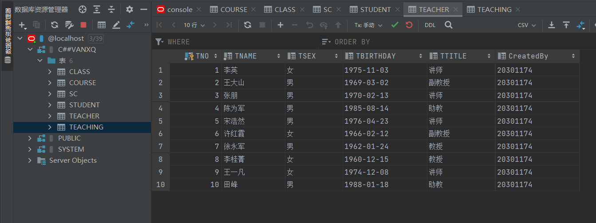

f) 教师任课情况表teaching的内容如下：

| Cno    | tno    | Language  |
| ------ | ------ | --------- |
| 800001 | 000001 | English   |
| 800002 | 000002 | Chinese   |
| 800003 | 000002 | Bilingual |
| 810011 | 000003 | Chinese   |
| 810013 | 000004 | English   |
| 800001 | 000005 | Chinese   |
| 800002 | 000006 | Chinese   |
| 800003 | 000007 | English   |
| 810011 | 000007 | English   |
| 810013 | 000008 | Bilingual |

SQL代码:

```sql
insert into TEACHING values ('000001','800001','English');
insert into TEACHING values ('000002','800002','Chinese');
insert into TEACHING values ('000002','800003','Bilingual');
insert into TEACHING values ('000003','810011','Chinese');
insert into TEACHING values ('000004','810013','English');
insert into TEACHING values ('000005','800001','Chinese');
insert into TEACHING values ('000006','800002','Chinese');
insert into TEACHING values ('000007','800003','English');
insert into TEACHING values ('000007','810011','English');
insert into TEACHING values ('000008','810013','Bilingual');
```

效果图:

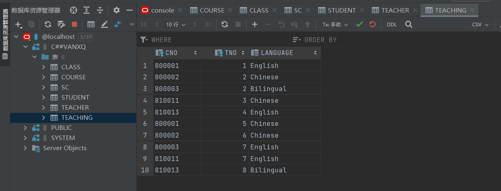

至此，保存并结束。任务完成。


附完整源码：

```sql
create table student
(
    sno           Varchar2(8)
        primary key ,
    sname         Varchar2(8) not null,
    ssex          Varchar2(3)  check(ssex in ('男' , '女')),
    sbirthday     date,
    classno       Varchar2(6),

    "Totalcredit" Smallint   default 0,
    "CreatedBy"   Varchar(8) default '20301174',
    foreign key (classno) references class(classno)
);

create table class
(
    classno       Varchar2(6)
            primary key,
    classname     Varchar(20) not null,
    classmajor    Varchar2(20),
    classdept     Varchar2(20),
    studentnumber smallint check ( studentnumber between 20 and 40)
);

create table course
(
    cno     Varchar2(6)
            primary key,
    cname   Varchar(30) not null,
    ccredit smallint check ( ccredit between 1 and 4)
);

create table sc
(
    sno   varchar(8),
    foreign key (sno) references student(sno),
    cno   varchar(6),
    foreign key (cno) references course(cno),
    grade integer check ( grade between 0 and 100)
);

create table teacher
(
    tno         Number(6)
            primary key,
    tname       Varchar2(8) not null,
    tsex        Varchar2(2) check(tsex in ('男' , '女')),
    tbirthday   date,
    ttitle      Varchar2(20),
    "CreatedBy" Varchar2(8) default '20301174'
);

create table teaching
(
    tno      Number(6),
    foreign key (tno) references teacher(tno),
    cno      Varchar2(6),
    foreign key (cno) references course(cno),
    language Varchar2(10) check (language in ( 'Chinese' , 'Bilingual' , 'English') )
);


alter table STUDENT
    modify SNAME VARCHAR2(9);

alter table TEACHER
    modify TSEX VARCHAR2(3);

alter table TEACHER
    modify TNAME VARCHAR2(9);

insert into CLASS values ('RJ2001','软件2001','软件工程','软件开发',24);
insert into CLASS values ('RJ2002','软件2002','软件工程','软件开发',26);
insert into CLASS values ('RJ2003','软件2003','软件工程','数字媒体',25);
insert into CLASS values ('RJ2004','软件2004','软件工程','软件开发',25);
insert into CLASS values ('RJ2005','软件2005','软件工程','数字媒体',24);
insert into CLASS values ('RJ2006','软件2006','软件工程','软件开发',24);

insert into COURSE values ('800001','计算机基础',4);
insert into COURSE values ('800002','程序设计语言',4);
insert into COURSE values ('800003','数据结构',4);
insert into COURSE values ('810011','数据库系统',4);
insert into COURSE values ('810013','计算机网络',3);
insert into COURSE values ('810015','微机原理与应用',4);

insert into  STUDENT values ('20300010','李在','男',to_date('2001/10/1','yyyy/mm/dd'),'RJ2001',default,default);
insert into  STUDENT values ('20300012','葛畅','男',to_date('2002/8/8','yyyy/mm/dd'),'RJ2001',default,default);
insert into  STUDENT values ('20300015','刘晶','女',to_date('2003/5/22','yyyy/mm/dd'),'RJ2001',default,default);
insert into  STUDENT values ('20300020','杨敏','女',to_date('2001/1/8','yyyy/mm/dd'),'RJ2001',default,default);
insert into  STUDENT values ('20300030','胡贤斌','男',to_date('2002/10/8','yyyy/mm/dd'),'RJ2001',default,default);
insert into  STUDENT values ('20300048','赵鸿泽','男',to_date('2003/6/6','yyyy/mm/dd'),'RJ2002',default,default);
insert into  STUDENT values ('20300050','王威','男',to_date('2004/6/10','yyyy/mm/dd'),'RJ2002',default,default);
insert into  STUDENT values ('20300067','赵玮','女',to_date('2002/8/21','yyyy/mm/dd'),'RJ2003',default,default);
insert into  STUDENT values ('20300075','王娜娜','女',to_date('2003/9/23','yyyy/mm/dd'),'RJ2003',default,default);
insert into  STUDENT values ('20300088','秦键','男',to_date('2004/3/1','yyyy/mm/dd'),'RJ2003',default,default);
insert into  STUDENT values ('20300100','田邦仪','女',to_date('2003/2/26','yyyy/mm/dd'),'RJ2004',default,default);
insert into  STUDENT values ('20300148','赵心砚','男',to_date('2002/4/25','yyyy/mm/dd'),'RJ2005',default,default);
insert into  STUDENT values ('20300150','杨青','女',to_date('2004/11/15','yyyy/mm/dd'),'RJ2005',default,default);
insert into  STUDENT values ('20300160','杨玲玲','女',to_date('2002/12/12','yyyy/mm/dd'),'RJ2006',default,default);

insert into SC values ('20300012','800003',88);
insert into SC values ('20300015','800003',null);
insert into SC values ('20300020','800003',91);
insert into SC values ('20300030','800003',78);
insert into SC values ('20300048','800003',97);
insert into SC values ('20300100','810011',67);
insert into SC values ('20300148','810011',58);
insert into SC values ('20300150','810011',89);
insert into SC values ('20300160','810011',71);

insert into TEACHER values ('000001','李英','女',to_date('1975/11/3','yyyy/mm/dd'),'讲师',default);
insert into TEACHER values ('000002','王大山','男',to_date('1969/3/2','yyyy/mm/dd'),'副教授',default);
insert into TEACHER values ('000003','张朋','男',to_date('1970/2/13','yyyy/mm/dd'),'讲师',default);
insert into TEACHER values ('000004','陈为军','男',to_date('1985/8/14','yyyy/mm/dd'),'助教',default);
insert into TEACHER values ('000005','宋浩然','男',to_date('1976/4/23','yyyy/mm/dd'),'讲师',default);
insert into TEACHER values ('000006','许红霞','女',to_date('1966/2/12','yyyy/mm/dd'),'副教授',default);
insert into TEACHER values ('000007','徐永军','男',to_date('1962/1/24','yyyy/mm/dd'),'教授',default);
insert into TEACHER values ('000008','李桂菁','女',to_date('1960/12/15','yyyy/mm/dd'),'教授',default);
insert into TEACHER values ('000009','王一凡','女',to_date('1974/12/8','yyyy/mm/dd'),'讲师',default);
insert into TEACHER values ('000010','田峰','男',to_date('1988/1/18','yyyy/mm/dd'),'助教',default);

insert into TEACHING values ('000001','800001','English');
insert into TEACHING values ('000002','800002','Chinese');
insert into TEACHING values ('000002','800003','Bilingual');
insert into TEACHING values ('000003','810011','Chinese');
insert into TEACHING values ('000004','810013','English');
insert into TEACHING values ('000005','800001','Chinese');
insert into TEACHING values ('000006','800002','Chinese');
insert into TEACHING values ('000007','800003','English');
insert into TEACHING values ('000007','810011','English');
insert into TEACHING values ('000008','810013','Bilingual');


```

