# 实验报告3-20301174-万兴全

**数据操作详细过程（包含SQL命令及执行结果展示）。**

**本次作业满分为40分，每题5分。**

使用SQL命令执行如下操作：

（1）  创建视图Grade_View显示所有同学的选课及成绩情况，列出学生的学号、姓名、班号、课程名称和成绩。

```sql
create view Grade_View as
    select student.SNO,student.SNAME,student.CLASSNO,CNAME ,sc.grade
    from student,course ,sc
    where sc.cno=course.cno and sc.sno=student.sno;
```

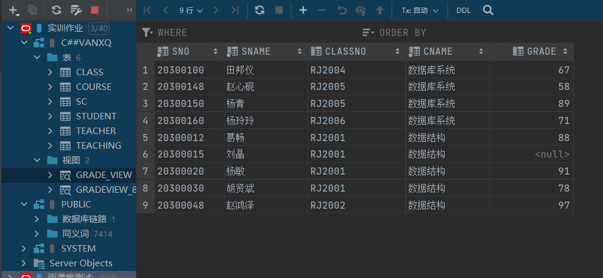

（2）  在视图Grade_View中查询“软件2001”班的同学的选课及成绩情况，显示学号、姓名、课程名称、成绩

```sql
select sno,sname,cname,grade
from Grade_View
where CLASSNO='RJ2001';
```

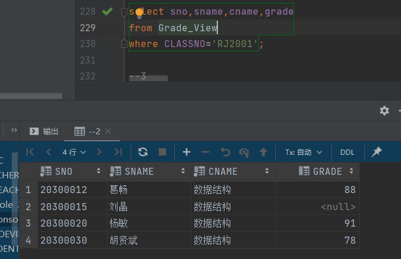

（3）  在视图Grade_View中插入如下元组：20300010，李在，软件2001，数据库系统，88（此为不成功的操作）。查询视图或基表记录验证视图操作。

```sql
insert into Grade_View values (20300010,'李在','RJ2001','数据库系统',88);
```

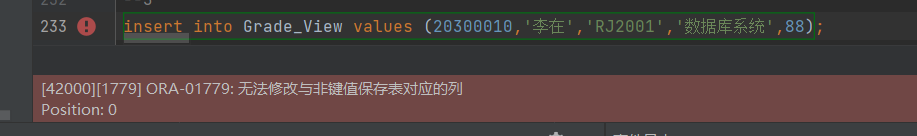

```sql
select * from Grade_View;
```

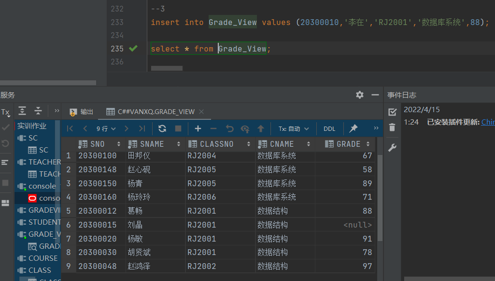

（4）  创建视图GradeView_80，用于存放成绩高于80分（含80）的选课信息, 显示学号、课程号和成绩，使用with check option选项。查询视图或基表记录验证视图操作。

```sql
create view GradeView_80 as
    select sno,cno,grade
    from sc
    where grade>=80
    with check option ;

select *from GRADEVIEW_80;
```

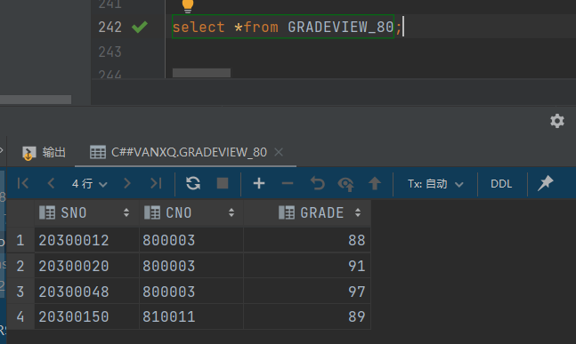

（5）  在视图GradeView_80中查询成绩高于90的选课信息。

```sql
select * from GRADEVIEW_80
where grade>90;
```

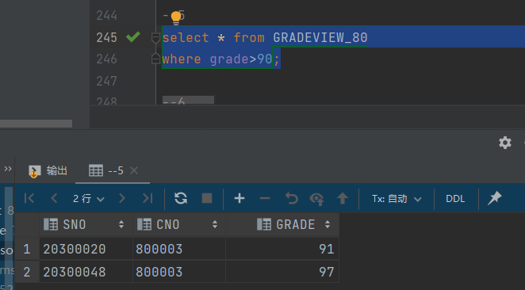

（6）  在视图GradeView_80中依次插入如下元组：

20301168，810011，87（可插入成功）

```sql
insert into student values (20301168,'rr',null,null,null,null,null,null,null);
insert into GRADEVIEW_80 (sno, cno, grade) values ('20301168','810011',87);
select * from GRADEVIEW_80;
```

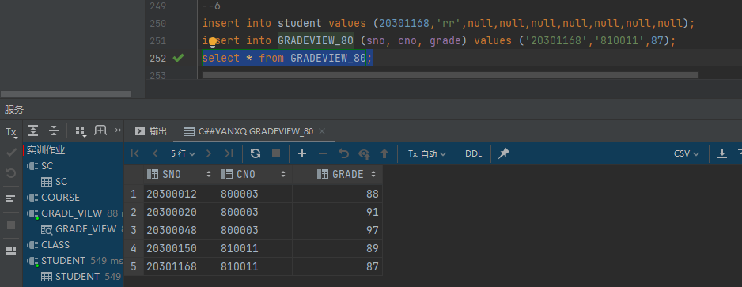

20301167，810011，78（插入不成功）

```sql
insert into student values (20301167,'qfs',null,null,null,null,null,null,null);
insert into GRADEVIEW_80 values (20301167,810011,78);
select * from GRADEVIEW_80;
```

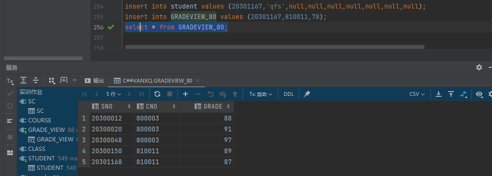

查询视图或基表记录验证视图操作。

（7）  在视图GradeView_80中依次修改如下元组

将（20301168，810011）所对应的成绩改为90；（可修改成功）

```sql
UPDATE GRADEVIEW_80
SET GRADE = 90
WHERE SNO = '20301168'AND CNO = '810011' ;
select * from GRADEVIEW_80;
```

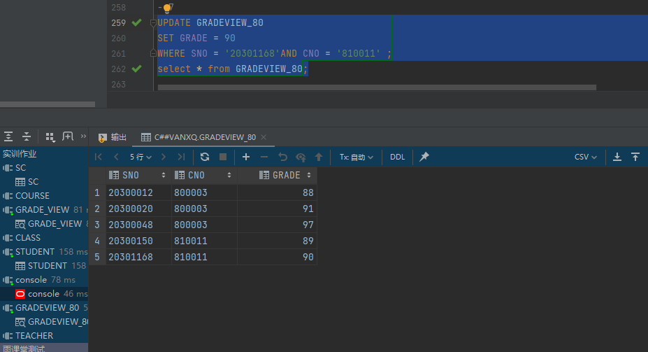

将（20301168，810011）所对应的成绩改为70；（修改不成功）

```sql
UPDATE GRADEVIEW_80
SET GRADE = 70
WHERE SNO = '20301168'AND CNO = '810011' ;
select * from GRADEVIEW_80;
```

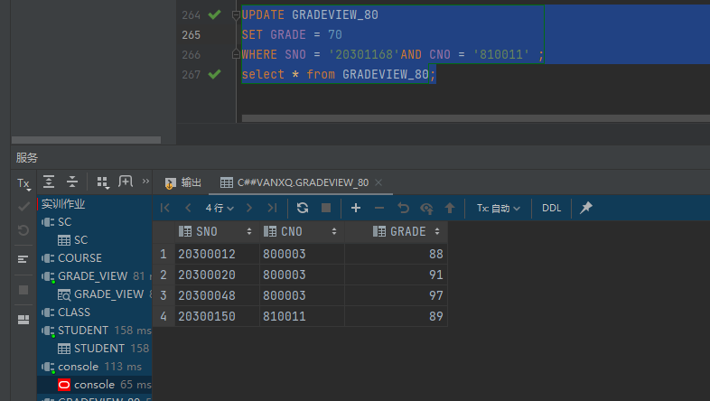

查询视图或基表记录验证视图操作。

（8）  在视图GradeView_80中删除如下元组：sno=20301168，cno=810011。

查询视图或基表记录验证视图操作。

```sql
insert into GRADEVIEW_80 (sno, cno, grade) values ('20301168','810011',87);
select * from GRADEVIEW_80;
```

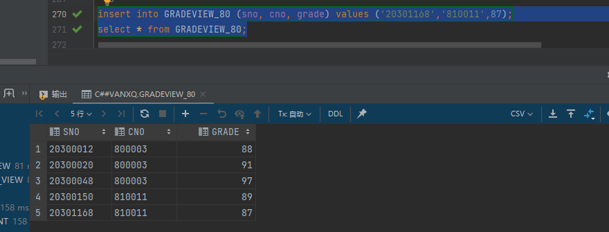

至于删除，不知是哪种情况，我把两种我的想法列出来

```sql
--第一种
UPDATE GRADEVIEW_80
SET SNO = '',
    CNO = ''
WHERE SNO ='20301168' AND CNO = '810011';
select * from GRADEVIEW_80;
```

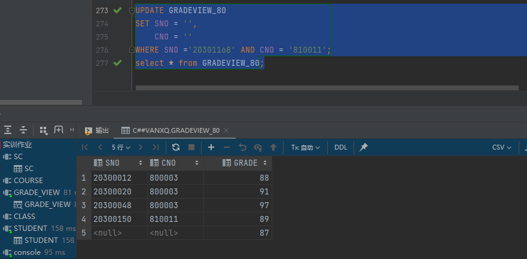

```sql
--第二种
delete
from GRADEVIEW_80
where sno='20301168' and cno = 810011;
select * from GRADEVIEW_80;
```

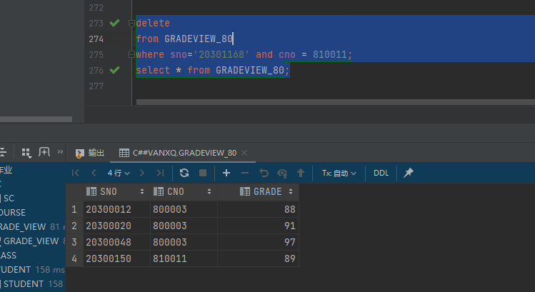


附 本实验报告源代码

```sql
--第三次实验报告

--1
create view Grade_View as
    select student.SNO,student.SNAME,student.CLASSNO,CNAME ,sc.grade
    from student,course ,sc
    where sc.cno=course.cno and sc.sno=student.sno;

--2
select sno,sname,cname,grade
from Grade_View
where CLASSNO='RJ2001';

--3
insert into Grade_View values (20300010,'李在','RJ2001','数据库系统',88);

select * from Grade_View;

--4
create view GradeView_80 as
    select sno,cno,grade
    from sc
    where grade>=80;

select *from GRADEVIEW_80;

--5
select * from GRADEVIEW_80
where grade>90;

--6
insert into student values (20301168,'rr',null,null,null,null,null,null,null);
insert into GRADEVIEW_80 (sno, cno, grade) values ('20301168','810011',87);
select * from GRADEVIEW_80;

insert into student values (20301167,'qfs',null,null,null,null,null,null,null);
insert into GRADEVIEW_80 values (20301167,810011,78);
select * from GRADEVIEW_80;

--7
UPDATE GRADEVIEW_80
SET GRADE = 90
WHERE SNO = '20301168'AND CNO = '810011' ;
select * from GRADEVIEW_80;

UPDATE GRADEVIEW_80
SET GRADE = 70
WHERE SNO = '20301168'AND CNO = '810011' ;
select * from GRADEVIEW_80;

--8
insert into GRADEVIEW_80 (sno, cno, grade) values ('20301168','810011',87);
select * from GRADEVIEW_80;

UPDATE GRADEVIEW_80
SET SNO = '',
    CNO = ''
WHERE SNO ='20301168' AND CNO = '810011';
select * from GRADEVIEW_80;
```
