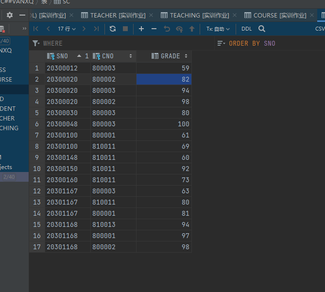

## 实验报告4-20301174-万兴全

数据操作详细过程（包含SQL命令及执行结果展示）。

每题5分，总计160分。

## (一)    复杂数据查询

**使用****SQL****命令执行如下查询操作：**

 如果查询结果为空，可以自行补充数据到基表中。

（1）  查询所有同学的学分情况（假设课程成绩>=60时可获得该门课程的学分），显示学号、姓名、总学分（用JOIN）

插入一些值，防null


```sql
select student.sno,sname,sum(course.ccredit) as totalcredit
from student join sc on student.sno = sc.sno right join course on course.cno=sc.cno
where grade>=60
group by sname,student.sno;
```


（2）  查询所有同学的平均成绩及选课门数，显示学号、姓名、平均成绩、选课门数

```sql
select student.sno,student.sname,avg(grade), count(sc.cno) as chosen_course
from student join sc on student.sno = sc.sno
group by student.sno, student.sname;
```


（3）  查询所有选修了课程但未参加考试的所有同学及相应的课程，显示学号、姓名、课程号、课程名称

插入一些值，防null


```sql
select student.sno,student.sname,s.cno,c2.cname
from student join sc s on student.sno = s.sno join course c2 on c2.cno = s.cno
where grade is null ;
```


（4）  查询所有选修了课程但考试不及格的所有同学及相应的课程，显示学号、姓名、课程号、课程名称、成绩


```sql
select s.sno,sname,s2.cno,course.cname,grade
from student s join sc s2 on s.sno = s2.sno join course on s2.cno = course.cno
where grade<60;
```


（5）  查询选修了课程名为“程序设计语言”的所有同学及成绩情况，显示学生姓名、课程成绩（用ANY运算符）

插入一些值，防null


```sql
select student.sname,grade 
from student join sc s on student.sno = s.sno join course c2 on c2.cno = s.cno
where cname = any('程序设计语言');
```


（6）  查询“软件开发”系的所有同学及成绩情况，显示学号、姓名、班级名称、课程号、课程名称、成绩

```sql
select student.sno,sname,classname,course.cno,cname,grade
from student join class c2 on c2.classno = student.classno join sc s on student.sno = s.sno join course on course.cno=s.cno
where classdept = any('软件开发');
```


（7）  查询成绩低于同门课程平均成绩的信息，显示学生学号、姓名、课程名称及低于平均成绩的值（即比平均成绩低多少）

```sql
select a.sno,a.sname,b.cname,d.grade-c.grade
from student a,course b,sc c,
    (select cno,avg(grade) grade
     from sc group by cno) d
where a.sno=c.sno and b.cno=c.cno and c.cno=d.cno and c.grade<d.grade;
```


（8）  查询和“葛畅”在同一班级的同学的姓名（使用子查询）

```sql
select sname
from Student
where classno=(select classno
            from Student
            where sname='葛畅');
```


（9）  查询没有选修“计算机基础”课程的学生姓名（用NOT EXISTS）

```sql
select sname
from Student
where not exists(
    select *
    from SC,course
    where student.sno=sc.sno and sc.cno=course.cno and cname='计算机基础');
```


（10）   查询主讲“数据库系统”和主讲“数据结构”的教师姓名（用UNION）

```sql
select teacher.tname
from Teacher join Teaching on Teacher.tno=Teaching.tno join Course on Course.cno=Teaching.cno
where cname='数据库系统'
union
select teacher.tname
from Teacher join Teaching on Teacher.tno=Teaching.tno join Course on Course.cno=Teaching.cno
where cname='数据结构';
```


（11）   查询讲授了所有课程的教师的姓名

插入一些值，防null


```sql
select tname
from teacher
where not exists
    (select *
     from course
     where not exists
        (select *
         from teaching
         where teacher.tno=teaching.tno and teaching.cno=course.cno));
```


（12）   查询同时选修学课程800001和800002的女同学的姓名


```sql
select student.sname
from student,sc s1,sc s2
where student.sno=s1.sno and student.sno=s2.sno and student.ssex='女' and s1.cno='800001' and s2.cno='800002'
group by sname;
```


（13）   查询有一门课程成绩为95分的女同学的姓名

添加新值防空


```sql
select sname 
from student,sc 
where student.sno=sc.sno and sc.grade=95;
```


（14）   查询选课数量大于3门的女同学的姓名

```sql
select sname
from student,sc
where student.sno=sc.sno and student.ssex='女'
having count(*) >3
group by sname,student.sno;
```


（15）   查询平均成绩大于80分的男同学的姓名

```sql
select sname
from student,sc
where student.sno=sc.sno and student.ssex='男'
having avg(grade) >80
group by student.sno,sname;
```


（16）   查询徐永军老师所教的每一门课程的平均成绩

```sql
select avg(grade)
from sc,teaching,teacher
where teacher.tno=teaching.tno and sc.cno=teaching.cno and teacher.tname='徐永军'
group by teaching.cno;
```


（17）   查询男同学每一个年龄组的人数,要求按人数升序输出人数超过20人的年龄组

增加值防查空


```sql
select age,count(*)
from student
where ssex='男'
group by age
having count(*) >20 order by count(*);
```


（18）   查询每门课程成绩都大于90分的学生姓名

改表防查空


```sql
select sname
from student,sc
    where sc.sno=student.sno
    having min(grade)>90
group by sname,student.sno;
```


（19）   查询比所有女同学年龄要大的男同学的姓名

改表防空


```sql
select sname
from student
where ssex='男' and age>(select max(student.age)
                        from student
                        where ssex='女');
```


（20）   查询未选修800002课程的女同学的姓名

```sql
select sname
from student,sc
    where student.sno=sc.sno and ssex='女' and cno<>800002;
```


（21）   查询所有课程成绩都及格的学生姓名

```sql
select sname
from student,sc
    where sc.sno=student.sno
    having min(grade)>=60
group by sname,student.sno;
```


（22）   查询选修课所有课程的学生姓名

防止查空，增值


```sql
select sname
from student
where not exists(select *
    from course
    where not exists(select *
        from sc
        where sc.sno=student.sno and sc.cno=course.cno));
```


（23）   查询选修了葛畅同学所选修的所有课程的学生姓名

```sql
select sname
from student
    where not exists(select *
                     from (select cno
                           from sc
                            where sc.sno=(select student.sno
                                   from student
                                   where sname='葛畅'))table_1 where not exists(select*
                                                                                from sc
                                                                                where student.sno=sc.sno and sc.cno = table_1.cno)) ;
```


（24）   查询平均成绩最高的学生姓名

```sql
select sname,avg(grade)
from student,sc
    where sc.sno=student.sno
group by sname
having avg(grade)>=all(select avg(grade)
                       from sc
                       where grade is not null
                       group by sc.sno);
```


（25）   找出比所在班级平均成绩高的学生信息

```sql
select sname,avg(grade)
from student,sc
    where sc.sno=student.sno
group by sname
having avg(grade)>=all(select avg(grade)
                       from sc
                       where grade is not null
                       group by sc.sno);
```


## (二)    使用DML

**使用****SQL DML****命令完成下列对****3****张表****Student****、****Course****、****SC****的各种更新操作，并查询显示测试结果：**


（1）  将选修徐永军老师所教课程的同学的成绩提高5%

1.05会报错，有限制，用1.03

```sql
update sc
set grade=grade*1.03
where sno in(select sc.sno
           from student,sc
           where student.sno =sc.sno and cno in(select cno
                                                from teaching
                                                    where tno=( select tno
                                                                from teacher
                                                                where  tname='徐永军')));
                                                                
select sname,grade
from student,sc
    where student.sno=sc.sno and cno in(select cno 
                                        from teaching 
                                        where tno=(select tno 
                                                   from teacher 
                                                   where tname='徐永军'));                                                           
                                                                
                                                                
```


（2）  在基本表Student中检索每一门课程成绩都大于等于80分的学生学号、姓名、性别，并把检索到的值送往另一个已存在的基本表STUD（S#，SNAME，SEX）。

```sql
create table STUD(
    s## varchar2(8),
    sname varchar2(8),
    ssex varchar2(2)
);

alter table STUD
    modify ssex varchar2(3);
alter table STUD
    modify sname varchar2(9);
insert into STUD select sc.sno,sname,ssex
                 from student,sc
                     where grade>=80 and student.sno=sc.sno;

select *from STUD;
```


（3）  在基本表SC中删除尚无成绩的选课记录。

```sql
delete from sc
where grade is null;
select * from sc;
```


（4）  把王威同学的学习选课和成绩全部删除。

```sql
delete from sc
where sno=(select sno 
           from student 
           where sname='王威');
select * from sc;
```


（5）  把选修数据结构课不及格的成绩全改为空值。

改值



```sql
update sc
set grade=null
where grade<60 and cno=(select cno from course where cname ='数据结构');
select * from sc;
```


（6）  把低于总平均成绩的女同学的成绩提高5%

```sql
update sc
set grade=grade*1.05
where sno in(select sno
             from sc
             where sno in(select sc.sno
                          from student,sc
                          where sc.sno=student.sno and ssex='女'and grade <(select avg(grade)
                                                                           from sc))
             group by sno);
select * from sc;
```


（7）  在基本表SC中修改800004课程的成绩，若成绩小于等于75分时提高5%，若成绩大于75分时提高4%但不能超过100分（用两个UPDATE语句实现），成绩只取整数部分（基表该字段类型为Integer）。按照需要，自己在相关基表中插入测试数据。

```sql
update sc
set grade=grade *1.05
where cno=800004 and grade<=75;
update sc
set grade=grade*1.04
where cno=800004 and grade>75;
select * from sc;
```


附源代码

```sql
--第四次实验报告
--1


select student.sno,sname,sum(course.ccredit) as totalcredit
from student join sc on student.sno = sc.sno right join course on course.cno=sc.cno
where grade>=60
group by sname,student.sno;

--2
select student.sno,student.sname,avg(grade), count(sc.cno) as chosen_course
from student join sc on student.sno = sc.sno
group by student.sno, student.sname;

--3
select student.sno,student.sname,s.cno,c2.cname
from student join sc s on student.sno = s.sno join course c2 on c2.cno = s.cno
where grade is null ;

--4
select s.sno,sname,s2.cno,course.cname,grade
from student s join sc s2 on s.sno = s2.sno join course on s2.cno = course.cno
where grade<60;

--5
select student.sname,grade
from student join sc s on student.sno = s.sno join course c2 on c2.cno = s.cno
where cname = any('程序设计语言');

--6
select student.sno,sname,classname,course.cno,cname,grade
from student join class c2 on c2.classno = student.classno join sc s on student.sno = s.sno join course on course.cno=s.cno
where classdept = any('软件开发');

--7
select a.sno,a.sname,b.cname,d.grade-c.grade
from student a,course b,sc c,
    (select cno,avg(grade) grade
     from sc group by cno) d
where a.sno=c.sno and b.cno=c.cno and c.cno=d.cno and c.grade<d.grade;

--8
select sname
from Student
where classno=(select classno
            from Student
            where sname='葛畅');

--9

select sname
from Student
where not exists(
    select *
    from SC,course
    where student.sno=sc.sno and sc.cno=course.cno and cname='计算机基础');

--10

select teacher.tname
from Teacher join Teaching on Teacher.tno=Teaching.tno join Course on Course.cno=Teaching.cno
where cname='数据库系统'
union
select teacher.tname
from Teacher join Teaching on Teacher.tno=Teaching.tno join Course on Course.cno=Teaching.cno
where cname='数据结构';

--11
select tname
from teacher
where not exists
    (select *
     from course
     where not exists
        (select *
         from teaching
         where teacher.tno=teaching.tno and teaching.cno=course.cno));

--12
select student.sname
from student,sc s1,sc s2
where student.sno=s1.sno and student.sno=s2.sno and student.ssex='女' and s1.cno='800001' and s2.cno='800002'
group by sname;

--13
select sname
from student,sc
where student.sno=sc.sno and sc.grade=95;

--14
select sname
from student,sc
where student.sno=sc.sno and student.ssex='女'
having count(*) >3
group by sname,student.sno;

--15
select sname
from student,sc
where student.sno=sc.sno and student.ssex='男'
having avg(grade) >80
group by student.sno,sname;

--16
select avg(grade)
from sc,teaching,teacher
where teacher.tno=teaching.tno and sc.cno=teaching.cno and teacher.tname='徐永军'
group by teaching.cno;


--17
select age,count(*)
from student
where ssex='男'
group by age
having count(*) >20 order by count(*);


--18
select sname
from student,sc
    where sc.sno=student.sno
    having min(grade)>90
group by sname,student.sno;


--19
select sname
from student
where ssex='男' and age>(select max(student.age)
                        from student
                        where ssex='女');


--20
select sname
from student,sc
    where student.sno=sc.sno and ssex='女' and cno<>800002;


--21
select sname
from student,sc
    where sc.sno=student.sno
    having min(grade)>=60
group by sname,student.sno;


--22
select sname
from student
where not exists(select *
    from course
    where not exists(select *
        from sc
        where sc.sno=student.sno and sc.cno=course.cno));


--23
select sname
from student
    where not exists(select *
                     from (select cno
                           from sc
                            where sc.sno=(select student.sno
                                   from student
                                   where sname='葛畅'))table_1 where not exists(select*
                                                                                from sc
                                                                                where student.sno=sc.sno and sc.cno = table_1.cno)) ;


--24
select sname,avg(grade)
from student,sc
    where sc.sno=student.sno
group by sname
having avg(grade)>=all(select avg(grade)
                       from sc
                       where grade is not null
                       group by sc.sno);


--25
select distinct student.sno, sname, ssex, sbirthday, table_1.classno,  age
from student,sc,(select classno,avg(grade) avg_1
                 from student join sc using (sno)
                 group by classno) table_1
                where sc.sno=student.sno and student.classno=table_1.classno and student.sno in(select sno
                                                                                                from sc
                                                                                                group by sno
                                                                                                having avg(grade)>avg_1)
group by sc.sno, sname, ssex, sbirthday, table_1.classno, age, grade, student.sno;


--1
update sc
set grade=grade*1.03
where sno in(select sc.sno
           from student,sc
           where student.sno =sc.sno and cno in(select cno
                                                from teaching
                                                    where tno=( select tno
                                                                from teacher
                                                                where  tname='徐永军')));
select sname,grade
from student,sc
    where student.sno=sc.sno and cno in(select cno
                                        from teaching
                                        where tno=(select tno
                                                   from teacher
                                                   where tname='徐永军'));

--2
create table STUD(
    s## varchar2(8),
    sname varchar2(8),
    ssex varchar2(2)
);

alter table STUD
    modify ssex varchar2(3);
alter table STUD
    modify sname varchar2(9);
insert into STUD select sc.sno,sname,ssex
                 from student,sc
                     where grade>=80 and student.sno=sc.sno;

select *from STUD;


--3
delete from sc
where grade is null;
select * from sc;


--4
delete from sc
where sno=(select sno
           from student
           where sname='王威');
select * from sc;

--5
update sc
set grade=null
where grade<60 and cno=(select cno from course where cname ='数据结构');
select * from sc;


--6
update sc
set grade=grade*1.05
where sno in(select sno
             from sc
             where sno in(select sc.sno
                          from student,sc
                          where sc.sno=student.sno and ssex='女'and grade <(select avg(grade)
                                                                           from sc))
             group by sno);
select * from sc;

--7
update sc
set grade=grade *1.05
where cno=800004 and grade<=75;
update sc
set grade=grade*1.04
where cno=800004 and grade>75;
select * from sc;
```
