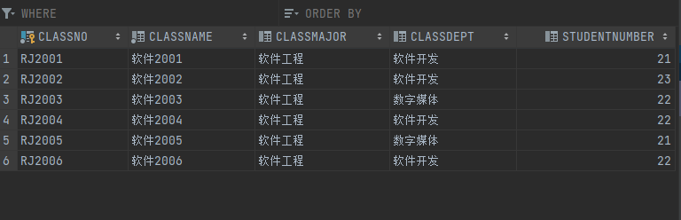

# 实验报告5-20301174-万兴全 

**存储过程源代码 + 测试执行\**过程结果\*\*输出\*\*的截图或者文字\**；**

**触发器源代码 + 测试执行过程结果\**输出\**的截图或者文字。**


**检查：****开发环境下****运行存储过程和触发器**

 

------

## 1.  存储过程（60分，每题10分）

在Oracle下用PL/SQL语句定义存储过程(太痛苦了)

（1） 创建一个能向学生表student中插入一条记录的存储过程insert_student，该过程需要5个参数，分别用来传递学号、姓名、性别、出生日期、班级号。

```sql
create procedure insert_student(
ssno in  student.sno%type,
ssname  in student.sname%type,
sssex in student.ssex%type,
ssbirthday in date,
sclassno  in student.classno%type
)
is 
begin
    insert into student(sno,sname,ssex,sbirthday,classno)values (ssno,ssname,sssex,ssbirthday,sclassno);
end;
```


写出调用存储过程insert_student的SQL语句，向数据表student中插入一个新同学，并提供相应的实参值。

调用前student表：


```sql
begin
    insert_student('20301174','万兴全','男',to_date('2001/3/20','yyyy/mm/dd'),'RJ2006');
end;
```


（2） 创建一个向课程表course中插入一门新课程的存储过程insert_course，该存储过程需要三个参数，分别用来传递课程号、课程名、学分，但允许参数“学分”的默认值为4，即当调用存储过程insert_course时，未给第三个参数“学分”提供实参值时，存储过程将按默认值4进行运算。

```sql
create or replace procedure insert_course(
ccno course.cno%type,
ccname course.cname%type,
cccredit int:=4
)
is
    begin
        insert into course (cno, cname, ccredit) values (ccno,ccname,cccredit);
    end;
```


调用存储过程insert_course，向课程表course中插入一门新课程。分两种情况（给出第三个参数和未给出第三个参数）写出相应的SQL命令，并比较结果。

插入前的course表


```sql
begin
    insert_course(000000,'体育课');
end;
begin
    insert_course(000001,'不上课',1);
end;
select * from course;
```


（3）创建一个名称为query_student的存储过程，该存储过程的功能是从数据表student中根据学号查询某一同学的姓名、性别、出生日期、班级号。

```sql
create or replace procedure query_student (
 ssno in student.sno%type
 )
as 
ssname student.sname%type;
sssex  student.ssex%type;
ssbirthday student.sbirthday%type;
sclassno student.classno%type;
begin
select sname,ssex,sbirthday,classno
into ssname,sssex,ssbirthday,sclassno
from student
where sno=ssno;
END;
```


调用存储过程query_student，查询学号为“20300150”的姓名、性别、出生日期、班级号，并写出完成此功能的SQL命令。

```sql
call INSERT_STUDENT('20301150','谁啊','男',to_date('2000/1/1','yyyy/mm/dd'),'RJ2002');

begin   query_student('20301150');
END;
```


（4） 建立存储过程，输出平均成绩大于80分的学生的姓名、性别、年龄和平均成绩。

```sql
create or replace procedure at_least_80
as
ssname student.sname%type;
sssex student.ssex%type;
ssage student.age%type;
agrade sc.grade%type;

begin
    select sname,ssex,age,avg(grade) as ag
    into ssname,sssex,ssage,agrade
    from student,sc
    where sc.sno=student.sno and agrade>80
    group by sname, ssex, age;
end;

call at_least_80();
```


调用该存储过程，并输出相应的结果。


（5） 写存储过程显示所有选择了与给定学生姓名选择的全部课程的学生的学号、姓名、选课数、平均成绩、总学分

```sql
create or replace procedure chosen_class(
ssname in student.sname%type
)as
    ssno student.sno%type;
    count_class int;
    avg_grade int;
    ttc int;
begin
    select student.sno,count(c2.cno),avg(grade),sum(ccredit)
    into ssno,count_class,avg_grade,ttc
    from student join sc s on student.sno = s.sno join course c2 on c2.cno = s.cno
    where student.sname=ssname
    group by student.sno
    ;
end;
call chosen_class('rr');
```


调用该存储过程，并根据指定的学生姓名输出与其相应的结果。


（6） 写存储过程显示所有平均成绩小于给定班级号的平均成绩的学生的学号、名字、平均成绩

```sql
create or replace procedure show_lasthalf(
cclassno class.classno%type
)as
    csno student.sno%type;
    csname student.sname%type;
    cag sc.grade%type;
begin
    select student.sno,student.sname,avg(grade)
    into csno,csname,cag
    from student join sc s on student.sno = s.sno
    group by student.sno, student.sname
    having avg(grade)< (select avg(grade) avg
                        from sc
                            join student s2 on s2.sno = sc.sno
                            join class c3 on c3.classno = s2.classno
                        where c3.classno=cclassno);
  
--游标（后知后觉），这个更加准确
create or replace procedure show_lasthalf_2
    (ssclassno student.classno%type)
is
    sssno student.sno%type;
    sssname student.sname%type;
    ssavggrade sc.grade%type;
begin
    declare
        cursor sscursor is
 select s.sno,sname,avg(grade)
 from student s,sc
 where s.sno=sc.sno
 group by s.sno,sname
 having avg(grade)<(select avg(grade)
                from student join sc using(sno)
                where classno=ssclassno
                group by classno);
        begin
 open sscursor;
 loop
     fetch sscursor into sssno,sssname,ssavggrade;
     exit when sscursor%notfound;
     dbms_output.put_line('sno:'||sssno||',name:'||sssname||',avg(grade):'||ssavggrade);
 end loop;
 close sscursor;
        end;
end;
call show_lasthalf('RJ2003');
```


调用该存储过程，并根据指定的班级号输出与其相应的结果。

调用成功，但是这里显示的是整个年级的分数低于给定班级号所对应均分的同学的四列信息，不是没有限制在给定班级内，与题意相符


## 2.  触发器（40分，每题5分）

```sql
--做到这里才后知后觉要用到游标，之前的有的可以用的但是我没用。

--游标很像指针，更像迭代器。
```

在Oracle下用PL/SQL语句定义触发器

（1） 创建一个当向学生表student中插入一新同学时能自动列出全部同学信息的触发器display_trigger。执行存储过程insert_student，向学生表中插入一个新同学，看触发器display_trigger是否被触发。

```sql
create or replace trigger display_trigger
    before insert on student
    for each row
    begin
    declare
        cursor c_1 is
        select * from student;
        c_2 student%rowtype;
        begin
        open c_1;
        loop
            fetch c_1 into c_2;
            exit when c_1 %notfound;
            DBMS_OUTPUT.PUT_LINE('sno:'||c_2.sno);
            DBMS_OUTPUT.PUT_LINE('sname:'||c_2.sname);
            DBMS_OUTPUT.PUT_LINE('ssex:'||c_2.ssex);
            DBMS_OUTPUT.PUT_LINE('sbirthday:'||c_2.sbirthday);
            DBMS_OUTPUT.PUT_LINE('classno:'||c_2.classno);
            DBMS_OUTPUT.PUT_LINE('age:'||c_2.age);
            end loop;
        close c_1;END;END;
 call insert_student('99999999','www','男',to_date('2000/1/1','yyyy/mm/dd'),'RJ2006');
```


（2） 创建一个触发器，当向学生表student中插入一新同学时能自动更新（增加1）class班级表中该生所在班级的总人数。

插入前


```sql
create or replace trigger aa
    after insert on student
    for each row
    begin
        update class
            set studentnumber=studentnumber+1
        where classno=:new.classno;
    end;
call insert_student('99999998','xxx','男',to_date('2000/1/1','yyyy/mm/dd'),'RJ2006');
```

插入一个六班同学后，发现六班的人数加了一


（3） 创建一个触发器，当从学生表student中删除一个同学时能自动更新（减1）class班级表中该生所在班级的总人数。

删前



```sql
create or replace trigger bb
    after delete on student
    for each row
    begin
        update class
            set studentnumber=studentnumber-1
        where classno=:old.classno;
    end;

delete
from student
where sno='99999998';
select *from class;
```


（4） 创建一个触发器，当将学生表student中某一个同学从一个班级改为另一个班级时，能自动更新class班级表中该生所在原来班级的总人数（减1）和新班级的总人数（增加1）。

变更前


```sql
create or replace trigger cc
    after update on student
    for each row
    begin
        update class
            set studentnumber=studentnumber-1
        where classno=:old.classno;
        update class
            set studentnumber=studentnumber+1
        where classno=:new.classno;
    end;
UPDATE STUDENT
SET CLASSNO = 'RJ2006'--原来是2005
WHERE SNO LIKE '20301150' ;
select *from class;
```


（5） 建一个触发器，当往SC表中插入一个在STUDENT 表中不存在的学号SNO时，就往STUDENT表中插入该学号的记录，对于有约束的字段如姓名、性别、班级号等随机产生有效值。

```sql
create or replace trigger trig_5
    after insert on sc
    for each row
    declare
        cs integer;
        begin
        select count(*) into cs from student where :new.sno=student.sno;
        if cs=0 then
            insert into student  values (:new.sno,'aaa','女',to_date('2000/1/1','yyyy/mm/dd'),default,default,20301174,default,default);
        end if;
    end;
```


（6） 写一个触发器阻止将学生成绩降低

```sql
create or replace trigger stop_lower
    before update of grade on sc
    for each row
    begin
        if:new.grade<:old.grade
            then raise_application_error('12345','球球了，不能再低了');
        end if;
    end;

update sc set grade=59 where sno='99999999';
```


（7） 在sc表上创建触发器，只要有人选修的课程超过3门，就中断操作并提示警告

20301168已选三门，执行代码


```sql
create or replace trigger trig_7
    after insert on sc
    for each row
    declare
        PRAGMA autonomous_transaction ;
        cursor cc is select count(cno)from sc group by sno;
        ca int;
        begin
        open cc;
        loop fetch cc into ca;
        exit when cc%notfound;
        if ca>=3 then
            raise_application_error(54321,'太卷啦太卷啦');
        end if;
    end loop;
        end;
insert into sc values (20301168,'800003',100);
```


（8） 创建一个触发器，当往SC表插入选修的课程时自动将该课程的学分累加到STUDENT表的该生的总学分（TOTALCREDIT）中，当从SC表中退课时自动从STUDENT表的该生的总学分中减去该课程的学分。

这里选一节没有人上过的好区分的课，名字叫“不上课”，一学分


```sql
create or replace trigger trig_8
after insert or delete on sc
for each row
begin
    if inserting then
        update student
            set TOTALCREDIT=TOTALCREDIT+(select ccredit
                                         from course
                                         where course.cno=:new.cno)
            where sno=:new.sno;
    else
        update student
            set TOTALCREDIT=TOTALCREDIT-(select ccredit
                                         from course
                                         where course.cno=:old.cno)
            where sno=:old.sno;

    end if;
end;
```

查看当前学分


增加选课后拿到一学分


撤销这门课


学分又变回0


##### 源码

```sql
--第五次实验报告
--(一)
--1

create or replace procedure insert_student(
ssno in  student.sno%type,
ssname  in student.sname%type,
sssex in student.ssex%type,
ssbirthday in date,
sclassno  in student.classno%type
)
is
begin
    insert into student(sno,sname,ssex,sbirthday,classno)values (ssno,ssname,sssex,ssbirthday,sclassno);
end;

begin
    insert_student('20301174','万兴全','男',to_date('2001/3/20','yyyy/mm/dd'),'RJ2006');
end;
select *from student;


--2
create or replace procedure insert_course(
ccno course.cno%type,
ccname course.cname%type,
cccredit int:=4
)
is
    begin
        insert into course (cno, cname, ccredit) values (ccno,ccname,cccredit);
    end;

begin
    insert_course(000000,'体育课');
end;
call
    insert_course(000001,'不上课',1);

select * from course;


--3
create or replace procedure query_student (
 ssno in student.sno%type
 )
as
ssname student.sname%type;
sssex  student.ssex%type;
ssbirthday student.sbirthday%type;
sclassno student.classno%type;
begin
select sname,ssex,sbirthday,classno
into ssname,sssex,ssbirthday,sclassno
from student
where sno=ssno;

END;
call INSERT_STUDENT('20301150','谁啊','男',to_date('2000/1/1','yyyy/mm/dd'),'RJ2002');

begin   query_student('20301150');
END;


--4
create or replace procedure at_least_80
as
ssname student.sname%type;
sssex student.ssex%type;
ssage student.age%type;
agrade sc.grade%type;

begin
    select sname,ssex,age,avg(grade)
    into ssname,sssex,ssage,agrade
    from student,sc
    where sc.sno=student.sno
     having avg(grade)>80
    group by sname, ssex, age;
end;

call at_least_80();
    select sname,ssex,age,avg(grade)
    from student,sc
    where sc.sno=student.sno
    having avg(grade)>80
    group by sname, ssex, age;
--5
create or replace procedure cs(
asname student.sname%type,
ssno out student.sno%type,
ssname out student.sname%type,
ca out int,
ag out int,
ttc out student.totalcredit%type

)is
cursor csc is select sc.sno,sname,count(cno),avg(grade),"Totalcredit"
into ssno,ssname,ca,ag,ttc
from student join sc s on student.sno = s.sno
and student.sno in(select sno from student
                              where not exists(select *
                                  from (select cno
                                        from sc
                                        where sno=(select sno
                                                   from student
                                                   where sname=asname))t
                                  where not exists(
                                      select *from sc where sc.cno=t.cno and sc.sno=student.sno
                                      )))
group by sc.cno,sname,"Totalcredit";
    begin open csc;
    loop fetch csc into ssno,ssname,ca,ttc;
    exit when csc%notfound;

        end loop;
    DBMS_OUTPUT.PUT_LINE(ssno||','||ssname||','||ag);
    close csc;
    end cs;

        declare
ssno  student.sno%type;
ssname student.sname%type;
ca int;
ag int;
ttc  student.totalcredit%type;
    begin

        cs('万兴全',ssno,ssname,ca,ag,ttc);
            end;

create or replace procedure chosen_class(
ssname in student.sname%type
)as
    ssno student.sno%type;
    count_class int;
    avg_grade int;
    ttc int;
begin
    select student.sno,count(c2.cno),avg(grade),sum(ccredit)
    into ssno,count_class,avg_grade,ttc
    from student join sc s on student.sno = s.sno join course c2 on c2.cno = s.cno
    where student.sname=ssname
    group by student.sno
    ;
end;
call chosen_class('rr');
    ;


--6
create or replace procedure show_lasthalf(
cclassno class.classno%type
)as
    csno student.sno%type;
    csname student.sname%type;
    cag sc.grade%type;
begin
    select student.sno,student.sname,avg(grade)
    into csno,csname,cag
    from student join sc s on student.sno = s.sno
    group by student.sno, student.sname
    having avg(grade)< (select avg(grade) avg
                        from sc
                            join student s2 on s2.sno = sc.sno
                            join class c3 on c3.classno = s2.classno
                        where c3.classno=cclassno);

    end;
    
    --游标（后知后觉）
create or replace procedure show_lasthalf
    (ssclassno student.classno%type)
is
    sssno student.sno%type;
    sssname student.sname%type;
    ssavggrade sc.grade%type;
begin
    declare
        cursor sscursor is
 select s.sno,sname,avg(grade)
 from student s,sc
 where s.sno=sc.sno
 group by s.sno,sname
 having avg(grade)<(select avg(grade)
                from student join sc using(sno)
                where classno=ssclassno
                group by classno);
        begin
 open sscursor;
 loop
     fetch sscursor into sssno,sssname,ssavggrade;
     exit when sscursor%notfound;
     dbms_output.put_line('sno:'||sssno||',name:'||sssname||',avg(grade):'||ssavggrade);
 end loop;
 close sscursor;
        end;
end;

call show_lasthalf('RJ2003');


--(二)
--1

create or replace trigger display_trigger
    before insert on student
    for each row
    begin
    declare
        cursor c_1 is
        select * from student;
        c_2 student%rowtype;
        begin
        open c_1;
        loop
            fetch c_1 into c_2;
            exit when c_1 %notfound;
            DBMS_OUTPUT.PUT_LINE('sno:'||c_2.sno);
            DBMS_OUTPUT.PUT_LINE('sname:'||c_2.sname);
            DBMS_OUTPUT.PUT_LINE('ssex:'||c_2.ssex);
            DBMS_OUTPUT.PUT_LINE('sbirthday:'||c_2.sbirthday);
            DBMS_OUTPUT.PUT_LINE('classno:'||c_2.classno);
            DBMS_OUTPUT.PUT_LINE('age:'||c_2.age);
            end loop;
        close c_1;END;END;
 call insert_student('99999999','www','男',to_date('2000/1/1','yyyy/mm/dd'),'RJ2006');


--2
create or replace trigger aa
    after insert on student
    for each row
    begin
        update class
            set studentnumber=studentnumber+1
        where classno=:new.classno;
    end;
call insert_student('99999998','xxx','男',to_date('2000/1/1','yyyy/mm/dd'),'RJ2006');
select *from class;

--3
create or replace trigger bb
    after delete on student
    for each row
    begin
        update class
            set studentnumber=studentnumber-1
        where classno=:old.classno;
    end;

delete
from student
where sno='99999998';
select *from class;

--4
create or replace trigger cc
    after update on student
    for each row
    begin
        update class
            set studentnumber=studentnumber-1
        where classno=:old.classno;
        update class
            set studentnumber=studentnumber+1
        where classno=:new.classno;
    end;
UPDATE STUDENT
SET CLASSNO = 'RJ2006'--原来是2005
WHERE SNO LIKE '20301150' ;
select *from class;


--5
create or replace trigger trig_5
    after insert on sc
    for each row
    declare
        cs integer;
        begin
        select count(*) into cs from student where :new.sno=student.sno;
        if cs=0 then
            insert into student  values (:new.sno,'aaa','女',to_date('2000/1/1','yyyy/mm/dd'),default,default,20301174,default,default);
        end if;
    end;

insert into sc(sno)values ('11111111');
select *from student;

--6
create or replace trigger stop_lower
    before update of grade on sc
    for each row
    begin
        if:new.grade<:old.grade
            then raise_application_error('12345','球球了，不能再低了');
        end if;
    end;

update sc set grade=59 where sno='99999999';

--7
create or replace trigger trig_7
    after insert on sc
    for each row
    declare
        PRAGMA autonomous_transaction ;
        cursor cc is select count(cno)from sc group by sno;
        ca int;
        begin
        open cc;
        loop fetch cc into ca;
        exit when cc%notfound;
        if ca>=3 then
            raise_application_error(54321,'太卷啦太卷啦');
        end if;
    end loop;
        end;
insert into sc values (20301168,'800003',100);


--8
create or replace trigger TRIG_8
    after insert or delete
    on SC
    for each row
begin
    if inserting then
        update student
            set TOTALCREDIT=TOTALCREDIT+(select ccredit
                                         from course
                                         where course.cno=:new.cno)
            where sno=:new.sno;
    else
        update student
            set TOTALCREDIT=TOTALCREDIT-(select ccredit
                                         from course
                                         where course.cno=:old.cno)
            where sno=:old.sno;

    end if;
end;

select ccredit from course where cno=1;

insert into sc
values ('20301174',1,90);
select "Totalcredit" from student where sno=20301174;

delete from sc where cno=1;
--麻了，真的麻了
```
