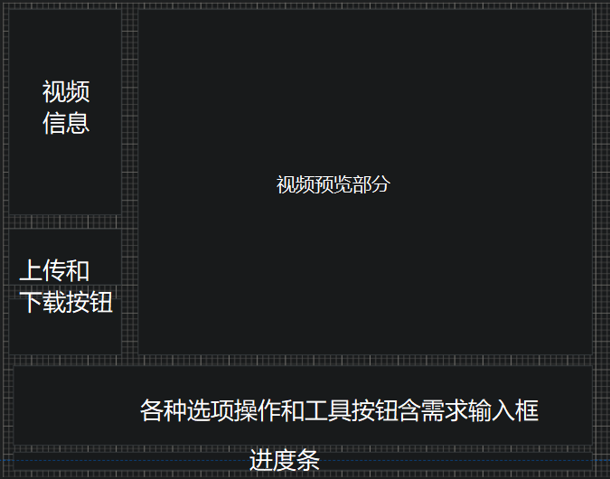

## 3 对外接口需求

### 3.1 用户界面

#### 界面风格

本系统所采用的是图形用户界面（GUI），用户友好型风格，方便用户操作。

考虑到后端维护人员的工作效率，本系统后端部分采用Linux下的terminal风格的界面，以此来提高工作效率。

#### 界面布局与界面内容

暂定稿如下：

#### 界面操作

（1）文字和语音输入

（2）各种视频处理操作

（3）上传和下载操作

（4）支持自定义操作，显示常用操作等等。

### 3.2 硬件接口

#### 支持硬件类型

支持所有主流的硬件设备。

#### 通信协议

(1)TCP/IP协议；

(1)支持自定义协议。

#### 存储器

SD卡，flash等等。其特性为：

(1)可选通信协议：SD模式和SPI模式等等

(2)数据寿命：10万次以上的编程/擦除。

(3)正向兼容MMC卡；

(4)运行在25M的频率上，数据带宽是4位，因此最大传输速率是12.5MHz(12.5兆字节每秒)；

以上特性，与本系统对视频编辑高性能，高内存的需求不谋而合。

#### CPU接口

PCI-e等等。

#### IO接口

### 3.3 软件接口

#### 数据库

本系统暂采用开源并且多平台的MySQL作为数据库。

#### 操作系统

开发软件时采用Windows操作系统，服务端将结合Linux操作系统。

最终将支持Windows和Android两种操作系统。MacOS待开发。

#### 工具：

#### 其他服务

(1)可通过手机的分享接口对接到各种其他应用的分享功能上，实现处理后即可分享的功能

(2)提供实时预览服务，即可随时查看视频处理进度和处理效果。

### 3.4 通信接口

本系统通过通信接口向服务端传输相关数据，并且可通过多种通信接口实现端对端的共享。

#### 以太网

以太网可灵活组网、多点通讯、传输距离不限、高速率等优点，是主流的通讯方式。

#### USB

作为最常用的通信接口，USB的主要作用是对设备内的数据进行存储或者设备通过USB接口对外部信息进行读取识别；除此以外，USB也是做二次开发的有效接口。虽然USB3.0的技术已经在笔记本电脑等领域应用的非常成熟，但是在视频领域，受处理速度和架构的影响，USB2.0已经非常够用。

#### 无线连接（Wireless）

无线连接是一种非常重要的通讯方式，它的特点是：无实体线连接，传输速率快，有很多仪器设备内部都直接内置了802.11无线接口。

