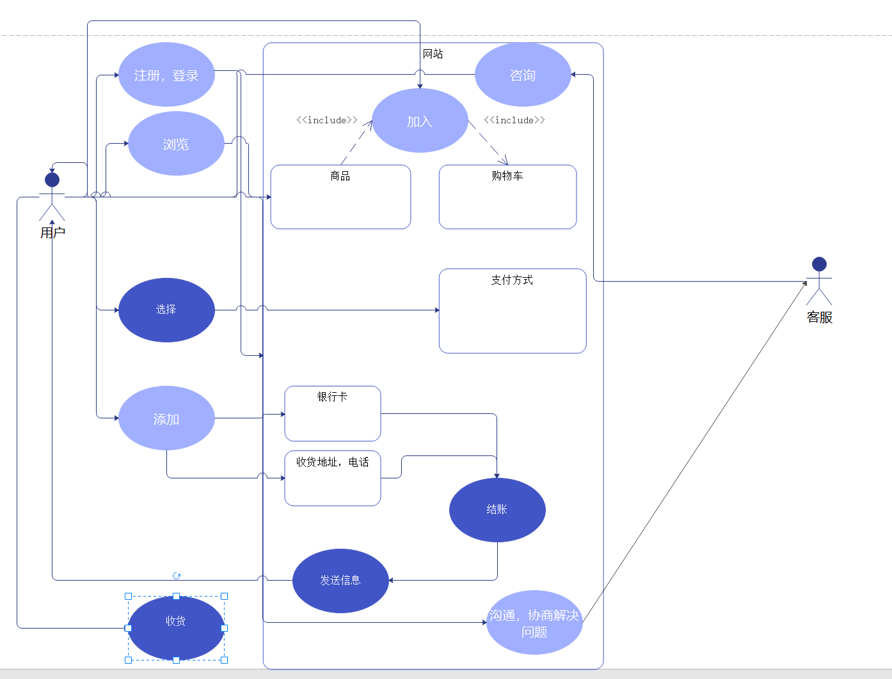
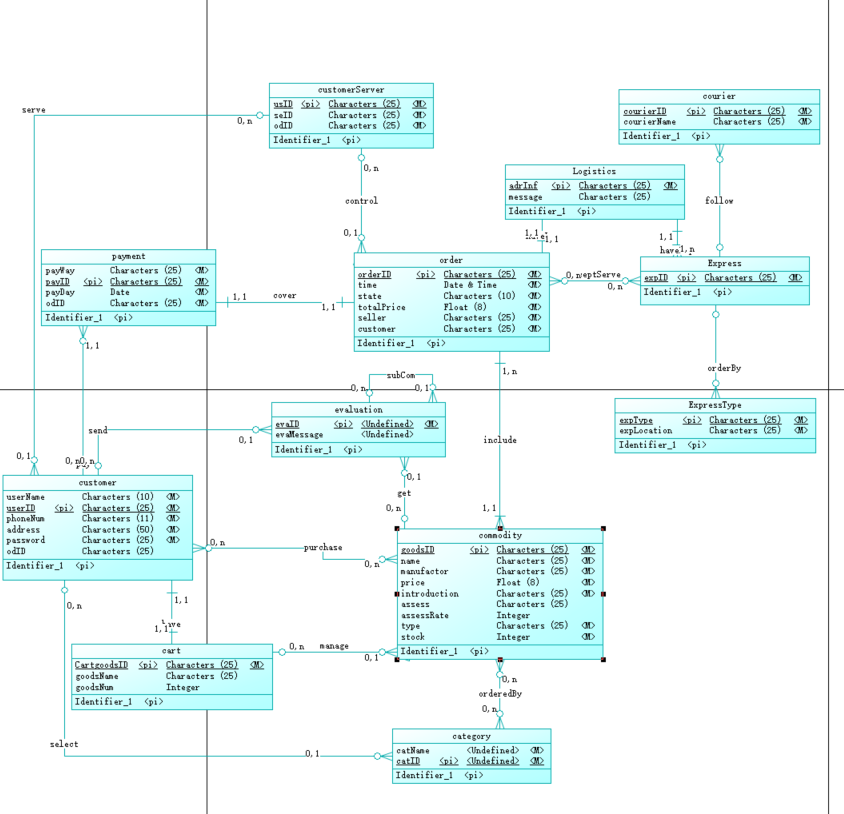
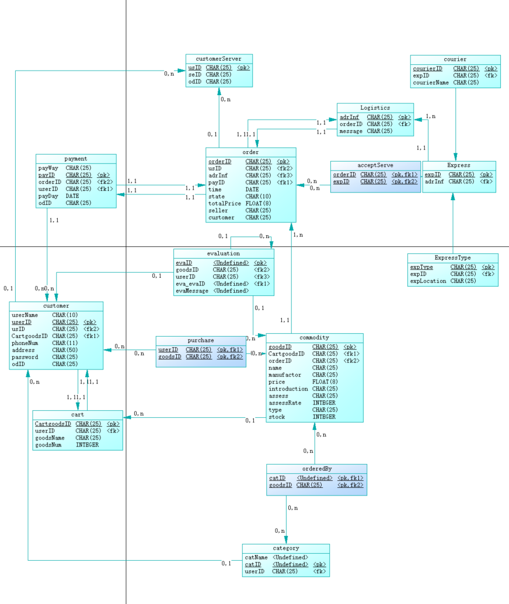
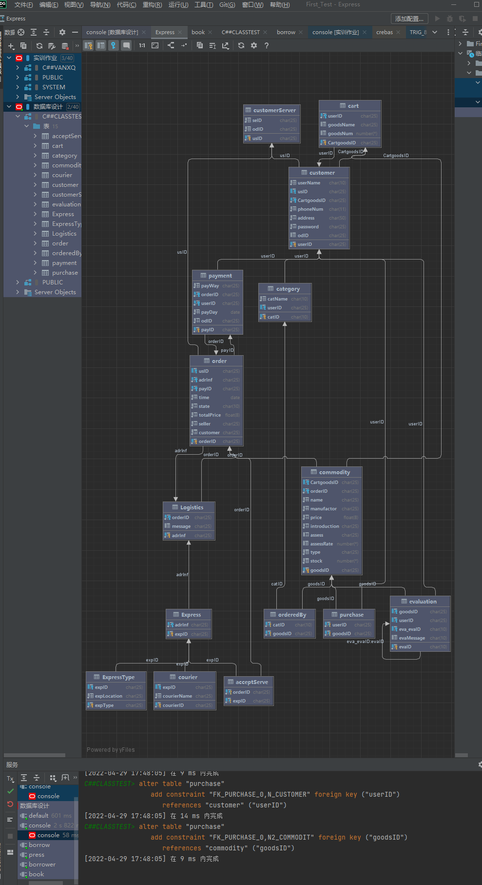

# DB设计报告-20301174-万兴全

## 1 问题描述

​		针对网上购物系统，需要自己到京东或淘宝网上去体验网上购物的流程，体会在整个网上购物过程中会涉及哪些实体？各实体应该包含哪些属性？ 各个实体之间是如何联系的？画出对应的ER模型，并设计对应的表结构，以及在数据库中建立这些表结构。

## 2 业务流程分析（用例图+业务流程图）

### 2.1 用例图



### 2.2 业务流程图


### 2.3.说明

​		用户首先需要到网上去注册，登陆；登陆后可以到网站上去浏览商品（在浏览商品时需要选择商品分类以及子分类后再浏览）；在浏览商品时如果有问题，可以联系客服人员咨询；把浏览后选中的商品放到购物车；此时可以去结账，也可以继续浏览购物，继续放到购物车，等选购你所需要的所有商品后再去结账；结账时可以选择支付方式，如银行卡支付需要绑定银行卡，结账；如果是第一次购物，在结账前需要你填写收货地址以及收货人和联系电话（ 可以填写多个收货地址）； 结账后会有物流的信息及时通知；收货后可以去确认收货， 并给出评价；如果商品出现问题，需要跟客服沟通，协商解决问题。

## 3 数据库实体、实体关系分析及ER模型图



## 4 物理模型及对应的SQL脚本文件

### 4.1 物理模型



### 4.2 SQL脚本文件

```sql
/*==============================================================*/
/* DBMS name:      ORACLE Version 11g                           */
/* Created on:     2022/4/29 17:37:09                           */
/*==============================================================*/


alter table "Express"
   drop constraint FK_EXPRESS_HAVEEXP_LOGISTIC;

alter table "ExpressType"
   drop constraint FK_EXPRESST_ORDERBY_EXPRESS;

alter table "Logistics"
   drop constraint FK_LOGISTIC_1,6_ORDER;

alter table "acceptServe"
   drop constraint FK_ACCEPTSE_0,N5_ORDER;

alter table "acceptServe"
   drop constraint FK_ACCEPTSE_0,N6_EXPRESS;

alter table "cart"
   drop constraint FK_CART_1,2_CUSTOMER;

alter table "category"
   drop constraint FK_CATEGORY_SELECT_CUSTOMER;

alter table "commodity"
   drop constraint FK_COMMODIT_INCLUDE_ORDER;

alter table "commodity"
   drop constraint FK_COMMODIT_MANAGE_CART;

alter table "courier"
   drop constraint FK_COURIER_FOLLOW_EXPRESS;

alter table "customer"
   drop constraint FK_CUSTOMER_1,1_CART;

alter table "customer"
   drop constraint FK_CUSTOMER_SERVE_CUSTOMER;

alter table "evaluation"
   drop constraint FK_EVALUATI_GET_COMMODIT;

alter table "evaluation"
   drop constraint FK_EVALUATI_SEND_CUSTOMER;

alter table "evaluation"
   drop constraint FK_EVALUATI_SUBCOM_EVALUATI;

alter table "order"
   drop constraint FK_ORDER_1,4_PAYMENT;

alter table "order"
   drop constraint FK_ORDER_1,5_LOGISTIC;

alter table "order"
   drop constraint FK_ORDER_CONTROL_CUSTOMER;

alter table "orderedBy"
   drop constraint FK_ORDEREDB_0,N3_CATEGORY;

alter table "orderedBy"
   drop constraint FK_ORDEREDB_0,N4_COMMODIT;

alter table "payment"
   drop constraint FK_PAYMENT_1,3_ORDER;

alter table "payment"
   drop constraint FK_PAYMENT_PAY_CUSTOMER;

alter table "purchase"
   drop constraint FK_PURCHASE_0,N_CUSTOMER;

alter table "purchase"
   drop constraint FK_PURCHASE_0,N2_COMMODIT;

drop index "haveExp_FK";

drop table "Express" cascade constraints;

drop index "orderBy_FK";

drop table "ExpressType" cascade constraints;

drop index 1,6_FK;

drop table "Logistics" cascade constraints;

drop index "0,n6_FK";

drop index "0,n5_FK";

drop table "acceptServe" cascade constraints;

drop index 1,2_FK;

drop table "cart" cascade constraints;

drop index "select_FK";

drop table "category" cascade constraints;

drop index "include_FK";

drop index "manage_FK";

drop table "commodity" cascade constraints;

drop index "follow_FK";

drop table "courier" cascade constraints;

drop index "serve_FK";

drop index 1,1_FK;

drop table "customer" cascade constraints;

drop table "customerServer" cascade constraints;

drop index "send_FK";

drop index "get_FK";

drop index "subCom_FK";

drop table "evaluation" cascade constraints;

drop index 1,5_FK;

drop index "control_FK";

drop index 1,4_FK;

drop table "order" cascade constraints;

drop index "0,n4_FK";

drop index "0,n3_FK";

drop table "orderedBy" cascade constraints;

drop index 1,3_FK;

drop index "pay_FK";

drop table "payment" cascade constraints;

drop index "0,n2_FK";

drop index "0,n_FK";

drop table "purchase" cascade constraints;

create table "Express"
(
   "expID"              CHAR(25)             not null,
   "adrInf"             CHAR(25)             not null,
   constraint PK_EXPRESS primary key ("expID")
);

/*==============================================================*/
/* Index: "haveExp_FK"                                          */
/*==============================================================*/
create index "haveExp_FK" on "Express" (
   "adrInf" ASC
);

/*==============================================================*/
/* Table: "ExpressType"                                         */
/*==============================================================*/
create table "ExpressType"
(
   "expType"            CHAR(25)             not null,
   "expID"              CHAR(25),
   "expLocation"        CHAR(25)             not null,
   constraint PK_EXPRESSTYPE primary key ("expType")
);

/*==============================================================*/
/* Index: "orderBy_FK"                                          */
/*==============================================================*/
create index "orderBy_FK" on "ExpressType" (
   "expID" ASC
);

/*==============================================================*/
/* Table: "Logistics"                                           */
/*==============================================================*/
create table "Logistics"
(
   "adrInf"             CHAR(25)             not null,
   "orderID"            CHAR(25)             not null,
   "message"            CHAR(25),
   constraint PK_LOGISTICS primary key ("adrInf")
);

/*==============================================================*/
/* Index: 1,6_FK                                                */
/*==============================================================*/
create index "1,6_FK" on "Logistics" (
   "orderID" ASC
);

/*==============================================================*/
/* Table: "acceptServe"                                         */
/*==============================================================*/
create table "acceptServe"
(
   "orderID"            CHAR(25)             not null,
   "expID"              CHAR(25)             not null,
   constraint PK_ACCEPTSERVE primary key ("orderID", "expID")
);

/*==============================================================*/
/* Index: "0,n5_FK"                                             */
/*==============================================================*/
create index "0,n5_FK" on "acceptServe" (
   "orderID" ASC
);

/*==============================================================*/
/* Index: "0,n6_FK"                                             */
/*==============================================================*/
create index "0,n6_FK" on "acceptServe" (
   "expID" ASC
);

/*==============================================================*/
/* Table: "cart"                                                */
/*==============================================================*/
create table "cart"
(
   "CartgoodsID"        CHAR(25)             not null,
   "userID"             CHAR(25)             not null,
   "goodsName"          CHAR(25),
   "goodsNum"           INTEGER,
   constraint PK_CART primary key ("CartgoodsID")
);

/*==============================================================*/
/* Index: 1,2_FK                                                */
/*==============================================================*/
create index "1,2_FK" on "cart" (
   "userID" ASC
);

/*==============================================================*/
/* Table: "category"                                            */
/*==============================================================*/
create table "category"
(
   "catName"            CHAR(10)             not null,
   "catID"              CHAR(10)             not null,
   "userID"             CHAR(25),
   constraint PK_CATEGORY primary key ("catID")
);

/*==============================================================*/
/* Index: "select_FK"                                           */
/*==============================================================*/
create index "select_FK" on "category" (
   "userID" ASC
);

/*==============================================================*/
/* Table: "commodity"                                           */
/*==============================================================*/
create table "commodity"
(
   "goodsID"            CHAR(25)             not null,
   "CartgoodsID"        CHAR(25),
   "orderID"            CHAR(25)             not null,
   "name"               CHAR(25)             not null,
   "manufactor"         CHAR(25)             not null,
   "price"              FLOAT(8)             not null,
   "introduction"       CHAR(25)             not null,
   "assess"             CHAR(25),
   "assessRate"         INTEGER,
   "type"               CHAR(25)             not null,
   "stock"              INTEGER              not null,
   constraint PK_COMMODITY primary key ("goodsID")
);

/*==============================================================*/
/* Index: "manage_FK"                                           */
/*==============================================================*/
create index "manage_FK" on "commodity" (
   "CartgoodsID" ASC
);

/*==============================================================*/
/* Index: "include_FK"                                          */
/*==============================================================*/
create index "include_FK" on "commodity" (
   "orderID" ASC
);

/*==============================================================*/
/* Table: "courier"                                             */
/*==============================================================*/
create table "courier"
(
   "courierID"          CHAR(25)             not null,
   "expID"              CHAR(25),
   "courierName"        CHAR(25)             not null,
   constraint PK_COURIER primary key ("courierID")
);

/*==============================================================*/
/* Index: "follow_FK"                                           */
/*==============================================================*/
create index "follow_FK" on "courier" (
   "expID" ASC
);

/*==============================================================*/
/* Table: "customer"                                            */
/*==============================================================*/
create table "customer"
(
   "userName"           CHAR(10)             not null,
   "userID"             CHAR(25)             not null,
   "usID"               CHAR(25),
   "CartgoodsID"        CHAR(25)             not null,
   "phoneNum"           CHAR(11)             not null,
   "address"            CHAR(50)             not null,
   "password"           CHAR(25)             not null,
   "odID"               CHAR(25),
   constraint PK_CUSTOMER primary key ("userID")
);

/*==============================================================*/
/* Index: 1,1_FK                                                */
/*==============================================================*/
create index "1,1_FK" on "customer" (
   "CartgoodsID" ASC
);

/*==============================================================*/
/* Index: "serve_FK"                                            */
/*==============================================================*/
create index "serve_FK" on "customer" (
   "usID" ASC
);

/*==============================================================*/
/* Table: "customerServer"                                      */
/*==============================================================*/
create table "customerServer"
(
   "usID"               CHAR(25)             not null,
   "seID"               CHAR(25)             not null,
   "odID"               CHAR(25)             not null,
   constraint PK_CUSTOMERSERVER primary key ("usID")
);

/*==============================================================*/
/* Table: "evaluation"                                          */
/*==============================================================*/
create table "evaluation"
(
   "evaID"              CHAR(10)             not null,
   "goodsID"            CHAR(25),
   "userID"             CHAR(25),
   "eva_evaID"          CHAR(10),
   "evaMessage"         CHAR(10),
   constraint PK_EVALUATION primary key ("evaID")
);

/*==============================================================*/
/* Index: "subCom_FK"                                           */
/*==============================================================*/
create index "subCom_FK" on "evaluation" (
   "eva_evaID" ASC
);

/*==============================================================*/
/* Index: "get_FK"                                              */
/*==============================================================*/
create index "get_FK" on "evaluation" (
   "goodsID" ASC
);

/*==============================================================*/
/* Index: "send_FK"                                             */
/*==============================================================*/
create index "send_FK" on "evaluation" (
   "userID" ASC
);

/*==============================================================*/
/* Table: "order"                                               */
/*==============================================================*/
create table "order"
(
   "orderID"            CHAR(25)             not null,
   "usID"               CHAR(25),
   "adrInf"             CHAR(25)             not null,
   "payID"              CHAR(25)             not null,
   "time"               DATE                 not null,
   "state"              CHAR(10)             not null,
   "totalPrice"         FLOAT(8)             not null,
   "seller"             CHAR(25)             not null,
   "customer"           CHAR(25)             not null,
   constraint PK_ORDER primary key ("orderID")
);

/*==============================================================*/
/* Index: 1,4_FK                                                */
/*==============================================================*/
create index "1,4_FK" on "order" (
   "payID" ASC
);

/*==============================================================*/
/* Index: "control_FK"                                          */
/*==============================================================*/
create index "control_FK" on "order" (
   "usID" ASC
);

/*==============================================================*/
/* Index: 1,5_FK                                                */
/*==============================================================*/
create index "1,5_FK" on "order" (
   "adrInf" ASC
);

/*==============================================================*/
/* Table: "orderedBy"                                           */
/*==============================================================*/
create table "orderedBy"
(
   "catID"              CHAR(10)             not null,
   "goodsID"            CHAR(25)             not null,
   constraint PK_ORDEREDBY primary key ("catID", "goodsID")
);

/*==============================================================*/
/* Index: "0,n3_FK"                                             */
/*==============================================================*/
create index "0,n3_FK" on "orderedBy" (
   "catID" ASC
);

/*==============================================================*/
/* Index: "0,n4_FK"                                             */
/*==============================================================*/
create index "0,n4_FK" on "orderedBy" (
   "goodsID" ASC
);

/*==============================================================*/
/* Table: "payment"                                             */
/*==============================================================*/
create table "payment"
(
   "payWay"             CHAR(25)             not null,
   "payID"              CHAR(25)             not null,
   "orderID"            CHAR(25)             not null,
   "userID"             CHAR(25)             not null,
   "payDay"             DATE                 not null,
   "odID"               CHAR(25)             not null,
   constraint PK_PAYMENT primary key ("payID")
);

/*==============================================================*/
/* Index: "pay_FK"                                              */
/*==============================================================*/
create index "pay_FK" on "payment" (
   "userID" ASC
);

/*==============================================================*/
/* Index: 1,3_FK                                                */
/*==============================================================*/
create index "1,3_FK" on "payment" (
   "orderID" ASC
);

/*==============================================================*/
/* Table: "purchase"                                            */
/*==============================================================*/
create table "purchase"
(
   "userID"             CHAR(25)             not null,
   "goodsID"            CHAR(25)             not null,
   constraint PK_PURCHASE primary key ("userID", "goodsID")
);

/*==============================================================*/
/* Index: "0,n_FK"                                              */
/*==============================================================*/
create index "0,n_FK" on "purchase" (
   "userID" ASC
);

/*==============================================================*/
/* Index: "0,n2_FK"                                             */
/*==============================================================*/
create index "0,n2_FK" on "purchase" (
   "goodsID" ASC
);

alter table "Express"
   add constraint FK_EXPRESS_HAVEEXP_LOGISTIC foreign key ("adrInf")
      references "Logistics" ("adrInf");

alter table "ExpressType"
   add constraint FK_EXPRESST_ORDERBY_EXPRESS foreign key ("expID")
      references "Express" ("expID");

alter table "Logistics"
   add constraint "FK_LOGISTIC_1,6_ORDER" foreign key ("orderID")
      references "order" ("orderID");

alter table "acceptServe"
   add constraint "FK_ACCEPTSE_0,N5_ORDER" foreign key ("orderID")
      references "order" ("orderID");

alter table "acceptServe"
   add constraint "FK_ACCEPTSE_0,N6_EXPRESS" foreign key ("expID")
      references "Express" ("expID");

alter table "cart"
   add constraint "FK_CART_1,2_CUSTOMER" foreign key ("userID")
      references "customer" ("userID");

alter table "category"
   add constraint FK_CATEGORY_SELECT_CUSTOMER foreign key ("userID")
      references "customer" ("userID");

alter table "commodity"
   add constraint FK_COMMODIT_INCLUDE_ORDER foreign key ("orderID")
      references "order" ("orderID");

alter table "commodity"
   add constraint FK_COMMODIT_MANAGE_CART foreign key ("CartgoodsID")
      references "cart" ("CartgoodsID");

alter table "courier"
   add constraint FK_COURIER_FOLLOW_EXPRESS foreign key ("expID")
      references "Express" ("expID");

alter table "customer"
   add constraint "FK_CUSTOMER_1,1_CART" foreign key ("CartgoodsID")
      references "cart" ("CartgoodsID");

alter table "customer"
   add constraint FK_CUSTOMER_SERVE_CUSTOMER foreign key ("usID")
      references "customerServer" ("usID");

alter table "evaluation"
   add constraint FK_EVALUATI_GET_COMMODIT foreign key ("goodsID")
      references "commodity" ("goodsID");

alter table "evaluation"
   add constraint FK_EVALUATI_SEND_CUSTOMER foreign key ("userID")
      references "customer" ("userID");

alter table "evaluation"
   add constraint FK_EVALUATI_SUBCOM_EVALUATI foreign key ("eva_evaID")
      references "evaluation" ("evaID");

alter table "order"
   add constraint "FK_ORDER_1,4_PAYMENT" foreign key ("payID")
      references "payment" ("payID");

alter table "order"
   add constraint "FK_ORDER_1,5_LOGISTIC" foreign key ("adrInf")
      references "Logistics" ("adrInf");

alter table "order"
   add constraint FK_ORDER_CONTROL_CUSTOMER foreign key ("usID")
      references "customerServer" ("usID");

alter table "orderedBy"
   add constraint "FK_ORDEREDB_0,N3_CATEGORY" foreign key ("catID")
      references "category" ("catID");

alter table "orderedBy"
   add constraint "FK_ORDEREDB_0,N4_COMMODIT" foreign key ("goodsID")
      references "commodity" ("goodsID");

alter table "payment"
   add constraint "FK_PAYMENT_1,3_ORDER" foreign key ("orderID")
      references "order" ("orderID");

alter table "payment"
   add constraint FK_PAYMENT_PAY_CUSTOMER foreign key ("userID")
      references "customer" ("userID");

alter table "purchase"
   add constraint "FK_PURCHASE_0,N_CUSTOMER" foreign key ("userID")
      references "customer" ("userID");

alter table "purchase"
   add constraint "FK_PURCHASE_0,N2_COMMODIT" foreign key ("goodsID")
      references "commodity" ("goodsID");


```


## 5.   在对应数据库中建立这些表结构的结果截图, 如数据库GUI管理工具截图

